# Lec.1 General Material Concept

## 半导体的晶体特性和发展

半导体是一类电导率在金属和非金属之间的材料。电导率 (Electrical conductivity) 指的是一种物质传导电流的能力，和电阻紧密相关：$\sigma=\frac{1}{\rho}$，其中 $\sigma$ 是电导率，单位是$m/\Omega$，$\rho$ 是电阻率 (Electrical resistivity)，单位是$\Omega/m$。

---

对于一个电阻，有欧姆定律 $I = \frac{V}{R}$，代换后有 $\sigma = \frac{l}{R A}$

常见的半导体有两种，一种是 **元素半导体 (Elemental Semiconductors)** ，如硅 (Si) 和锗 (Ge)，因为他们由单一种类原子组成；另一种是 **化合物半导体 (Compound Semiconductors)**，如砷化镓 (GaAs) 和氮化镓 (GaN)。

半导体和其他材料最大的区别在于它的能带间隙，即 **禁带宽度 (Band gap)**，它决定了材料的导电性能。为了研究半导体的特性，有必要了解材料中的原子排列。

晶格 (Crystal Lattice) 是指材料中原子的周期性排列。晶体的独特之处，就是它的周期性排列。晶体的周期性是在空间中以对称排列的点阵来定义的，在每个点阵点上添加原子，形成一种叫做基元 (basis) 的排列。

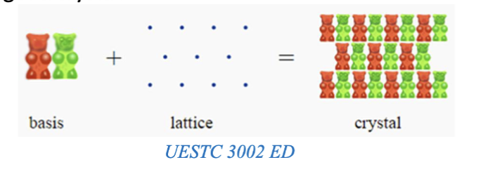

由于在一定的体积里放置原子的方式有很多种，原子之间的距离和方向有多种形式，所以可能会产生不同的晶格和晶体结构。比如简单堆积 (Simple Cubic, SC)、体心立方 (Body-Centered Cubic, BCC)、面心立方 (Face-Centered Cubic, FCC) 等等。

原子被填充在点阵中时，相互之间会有力相互吸引以及相互排斥，最终稳定的状态是二者相互平衡。这里可以将原子近似为一个球体来计算。在这种情况下，可以计算出一个晶格体积下可以填充的原子体积。一个晶格的边长被称为 晶格常数 (Lattice Constance)，用 $a$ 表示。对于不同的晶格结构，可以计算出填充因子 (Packing Factor)

在讨论晶体时，一个很重要的方向是获得点阵内的平面和方向。这种符号系统使用三个整数来描述点阵哪平面和向量的位置：

1. 找到平面与晶轴的截距，并将这些截距表示为基向量的整数倍（可以将平面沿其方向移入移出原点，直到在每个轴上都发现整数截距）
2. 取步骤 1 中找到的三个整数的倒数，并将它们简化为最小的整数集合 $h,k,l$，这些整数彼此之间具有与三个倒数相同的关系
3. 标记该平面为 $(h,k,l)$

在空间直角坐标系中，这三个数字实际上组成的就是这个面的法向量。

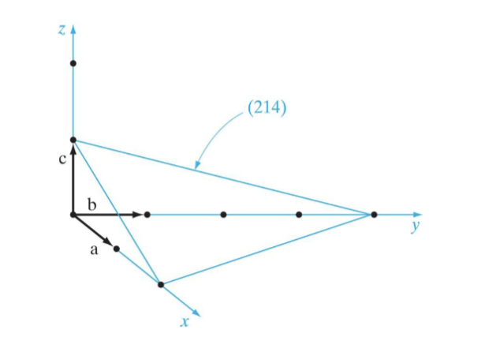

从晶体学的角度，晶格中相互平行、可以通过平移重合的面是等效的。

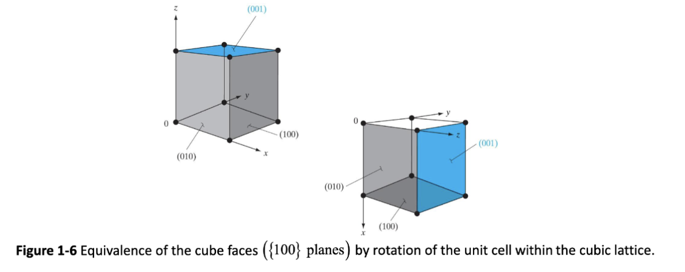

晶格中的方向同样用三个整数表示。各个方向的向量方向是对应边的方向，且长度和对应的边相同，以这三个向量作为基底建立坐标系。这样，每个方向都可以以从原点指向某个坐标的向量决定，记作 $[a b c]$。等效的方向用尖括号表示 $<a b c>$，比如对于立方晶格，相邻边垂直相等，$[1 0 0]$ $[0 1 0]$ $[0 0 1]$ 是等效的，记作 $<1 0 0>$

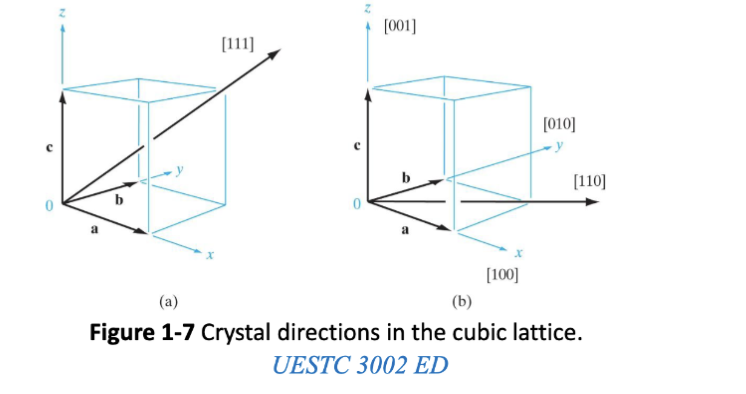

许多重要的半导体的基本晶体结构是剧有两原子基的面心立方点阵，进而产生金刚石结构————比如 Si, Ge, 以及金刚石形态的 C。描述金刚石结构的简单方式是吧金刚石结构看作一个面心立方点阵，在每一个面心立方原子处放置一个额外的原子，对应的位置是 $\frac{a + b + c}{4}$

## 晶格和晶胞

原子堆积因子 (Atomic Packing Factor, APF) 的定义是一定体积内被原子占据的体积与该体积的比值。APF 可以用来描述晶体中原子的紧密程度。对于不同的晶体结构，APF 的值是不同的。

$$
\mathrm{APF} = \frac{V_{\text{atom}}}{V_{\text{cell}}}
$$

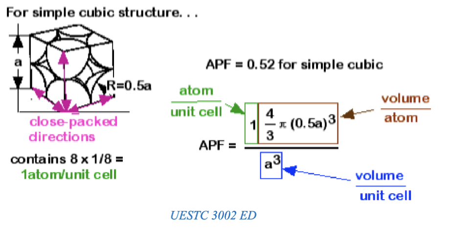

对于体心立方堆积 (BCC)，根据原子是硬球体的等效，其在对角线上接触紧密，故有 $a^2 + (\sqrt{2}a)^2 = (4r)^2$，其中 $r$ 是原子的半径，进而计算出 APF。

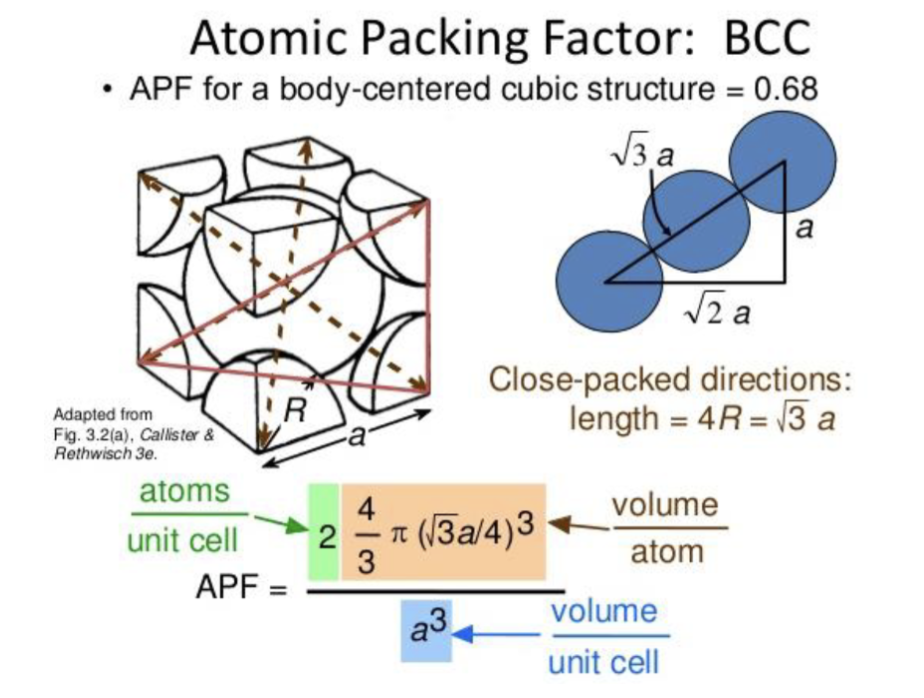

对于面心立方堆积 (FCC)，则是在面对角线上紧密接触，有 $2 \cdot a^2 = (4r)^2$，其中 $r$ 是原子的半径。

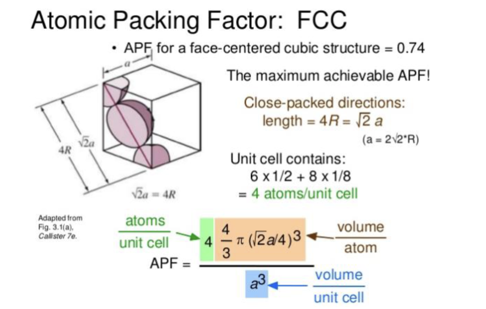

## 晶体生长

固态器件技术的发展不仅取决于器件概念的进步，还取决于材料的改进。例如，如今能够制造集成电路的事实，是 20 世纪 50 年代早期和中期在纯单晶硅生⻓方面取得重大突破的结果。对器件级半导体晶体生⻓的要求比任何其他材料都更为严格。不仅半导体必须以大单晶形式存在，而且纯度必须控制在极其严格的范围内。例如，用于设备的 Si 晶体在生⻓过程中，大多数杂质的浓度低于十亿分之一。这种纯度要求
在制造过程中对材料进行仔细的处理和操作。Si 晶体的原料是二氧化硅（SiO₂）。SiO₂ 在高温炉（~1800°C）中与 C 反应，根据以下反应式还原 SiO₂：

$$
SiO_2 + 2C \rightarrow Si + 2CO
$$

这形成了冶金级别的硅单质 (Metallurgical Grade Si, MGS)，其中含有 2ppm (Parts per million) 级别的杂质，还需要进一步提纯得到半导体级别或电子级硅 (Electronic-Grade Si, EGS)，杂质降低到 ppb (Parts per billion) 级别

$$
Si + 3HCl \rightarrow SiHCl_3 + H_2 \\
2SiHCl_3 + 2H_2 \rightarrow 2Si + 6HCl
$$

下一步是把高纯度但是仍然是多晶的 EGS 硅转化成单晶硅 (ingots)，这一步使用的方法叫做柴可拉斯基法 (Czochralski Method)。

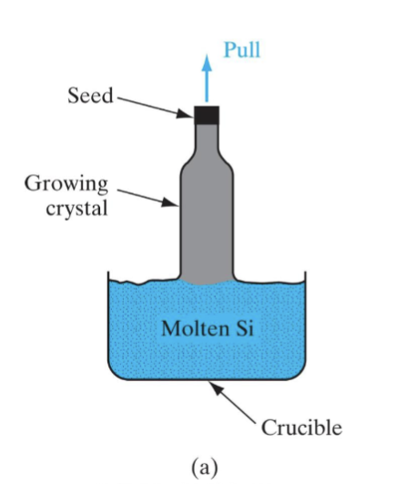

这个过程首先需要一个籽晶 (Seed Crystal)，把它下降到熔融的硅中，然后缓慢提起，让晶体在籽晶上生长，进而产生大块单晶硅。之后，在产生的单晶硅上进行操作，生产出晶圆以及芯片。

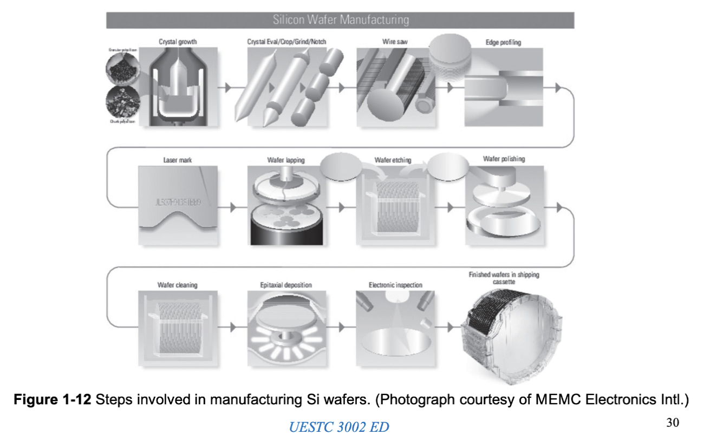

## 原子和电子

光电效应 (Photoelectric Effect) 是指当光照射到某些材料表面时，材料会释放电子的现象。这个现象最早由爱因斯坦在 1905 年解释，他提出光具有粒子性，光子 (Photon) 的能量与其频率成正比，公式为 $E = h\nu$，其中 $h$ 是普朗克常数，$\nu$ 是光的频率。普朗克指出，辐射是以离散的能量单位发射的，成为 量子 (Quantum)。

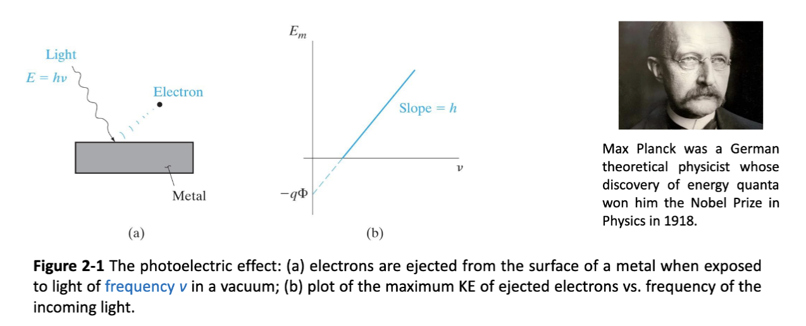

光电效应是一个重要的量子现象，它让我们能够清晰的理解光和电子的量子性质。这一效应说明光表现为被称为光子的离子，每个光子携带特定的能量。

我们用来理解原子的原子模型一般是一个简化的模型，被称为壳层模型 (Shell Model)，基于玻尔模型。电子在固定半径的离散量子化轨道上绕原子核运行；电子可以被视为包含在一个特定半径内的球形壳内的电荷；电子可以通过失去或吸收能量从一个轨道跃迁到另一个轨道。

原子的质量集中在原子核 (nudeus) 上，原子核由质子和中子组成。质子带正电，中子不带电。电子带负电，质量远小于质子和中子。中子和质子的质量大致相同。原子核中的质子数就是元素的原子序数。电子数等于质子数，因此原子整体上是电中性的。

电子被认为在原子核外非常大的距离绕核运动。电子的位置主要由两组整数标记：主量子数 $n$ 和角量子数 $l$。主量子数 $n$ 决定电子的能量和电子云的大小，$n$ 的值为正整数 (1, 2, 3, ...)。角量子数 $l$ 决定电子云的形状，$l$ 的值为非负整数 (0, 1, 2, ..., n-1)。每个 $n$ 和 $l$ 对应一个电子壳 (shell) 和亚壳 (subshell)。每个亚壳可以容纳一定数量的电子，具体数量由 $2(2l + 1)$ 给出。对于 $n = 1,2,3,4,...$ 的壳分别标记为 K, L, M, N, ...，对于 $l = 0,1,2,3,...$ 的亚壳分别标记为 s, p, d, f, ...

对于一个亚层，电子的自旋 (spin) 量子数 $m_s$ 可以取两个值：+1/2 或 -1/2。根据泡利不相容原理 (Pauli Exclusion Principle)，每个亚层最多可以容纳 $2(2l + 1)$ 个电子。当一个亚层被填满后，它不再能容纳更多电子，此时它被认为是稳定的 (stable)。

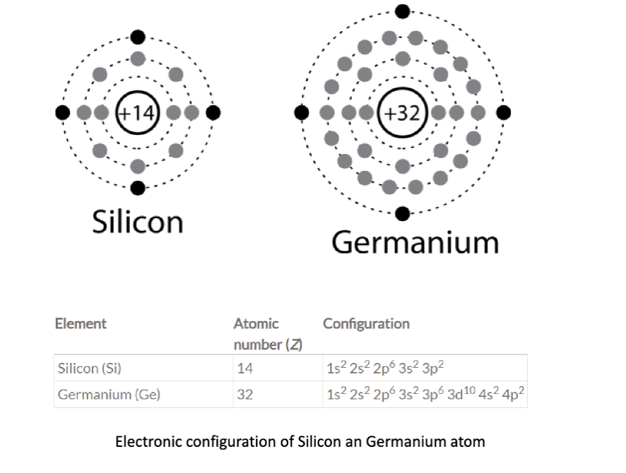

## 能带

固体中相邻原子之间的电子将晶体结合在一起，比如 NaCl 表现为离子键结合 (ionic bonding)。在离子键中，一个原子向另一个原子提供电子使其保持稳定，电子大部分时间靠近结合的原子。

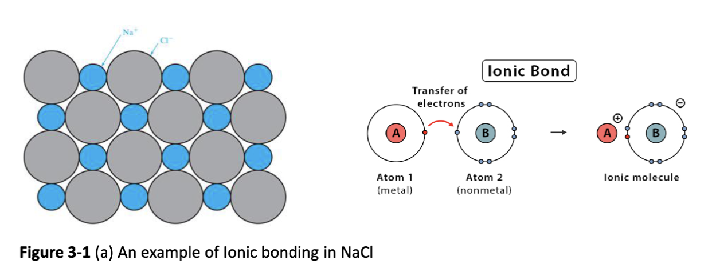

在共价键 (covalent bond) 中，原子通过共享电子来结合。电子在两个原子核之间的空间中移动，形成一个稳定的结合状态。共价键通常比离子键更强，因为电子在两个原子之间共享，使得结合更牢固。比如对于金刚石晶体，每个碳原子通过共价键与四个相邻的碳原子结合，在价电子层形成八个电子的八隅体 (octet) 结构，进而形成一个坚固的三维网络结构。

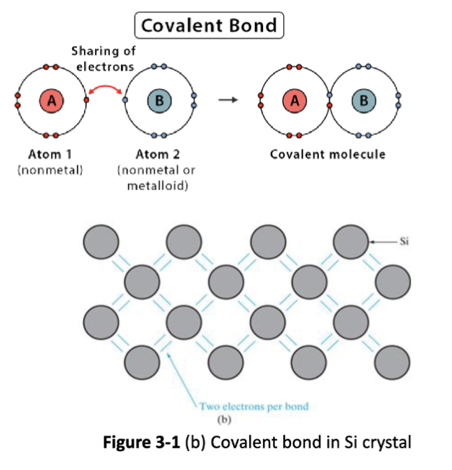

根据博尔德理论，原子的每一层在不同的能级上有着离散的能量。当两个原子靠的很近时，他们的相互作用会让能级分裂成多个能级，形成一个能带。随着更多原子的加入，能级分裂得越来越细，最终形成连续的能带。在能带中，电子可以在一定范围内自由移动，而不是局限于单个原子。

当原子结合形成物质时，最外层、亚层、轨道会合并，为电子提供更多的可用能级。当大量原子彼此靠近时，这些能级变得如此接近，以至于它们形成了连续的能带。当键能最小时，会形成平衡，这时候两个原子之间的合力为 0。

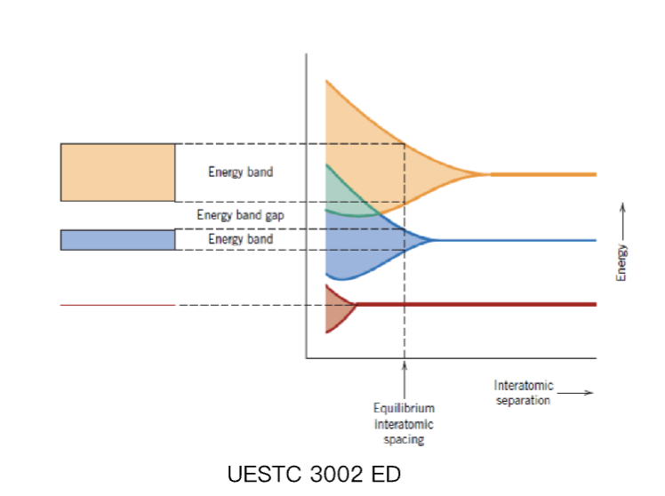

当原子在晶体中紧密排列时，每个能级都会分裂成包含大量紧密排列状态的能带。这些能带被称为禁带 (forbidden gaps) 或带隙 (band gaps) $E_g$ 的禁止能量区域所分隔。完全被电子填满的最后一个能带称为价带 (valence band) $E_v$。下一个可能为空或部分被电子填充的能带称为导带 (conduction band) $E_c$。

一个原子的最外层电子 (outermost shell) 被称为价电子 (valence electrons)，这些价电子包含一系列的能级，形成价带。价带中的电子与原子核的结合较弱，因此它们可以通过吸收能量跃迁到导带。导带中的电子可以自由移动，从而使材料具有导电性。价带好导带之间的间隙被称为禁带 (band gap) 或带隙 (forbidden gap)，用 $E_g$ 表示。禁带的大小决定了材料的导电性能。禁带没有能量，因此电子不能存在于禁带中。

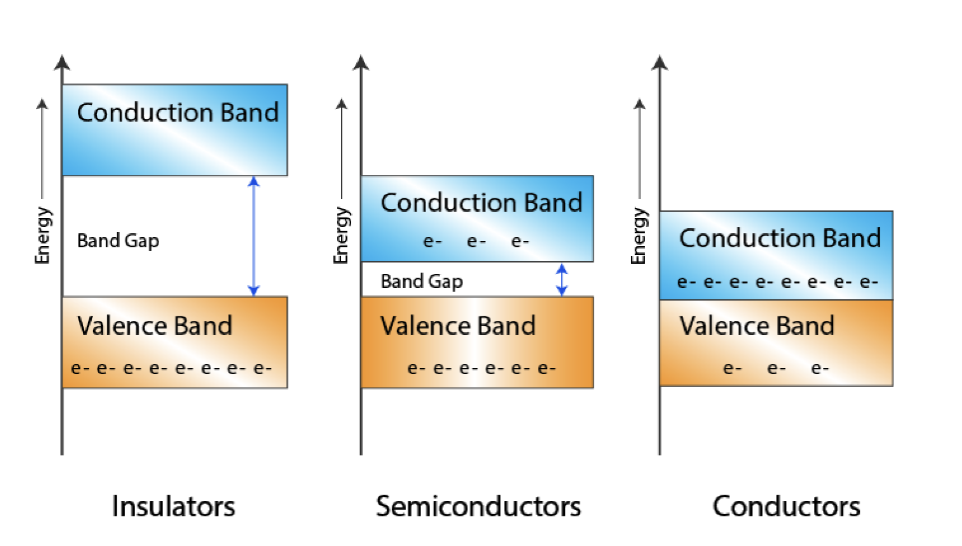

半导体材料在 0K 时性质和绝缘体基本相同，价带被完全填满，导带为空。然而，半导体的 $E_g$ 远小于绝缘体，随着温度的升高，一些电子会获得足够的能量跃迁到导带，形成自由电子 (free electrons)，这些电子可以在导带中自由移动，从而使材料具有导电性。

半导体的带隙可以是两种类型：直接带隙 (direct band gap) 和间接带隙 (indirect band gap)。在直接带隙半导体中，价带的最高点和导带的最低点在动量空间中位于相同的位置，这使得电子可以直接从价带跃迁到导带，通常伴随着光子的吸收或发射。典型的直接带隙半导体包括砷化镓 (GaAs) 和氮化镓 (GaN)。在间接带隙半导体中，价带的最高点和导带的最低点在动量空间中位于不同的位置，这意味着电子在跃迁过程中需要同时改变其动量，通常通过与晶格振动（声子）的相互作用来实现。典型的间接带隙半导体包括硅 (Si) 和锗 (Ge)。

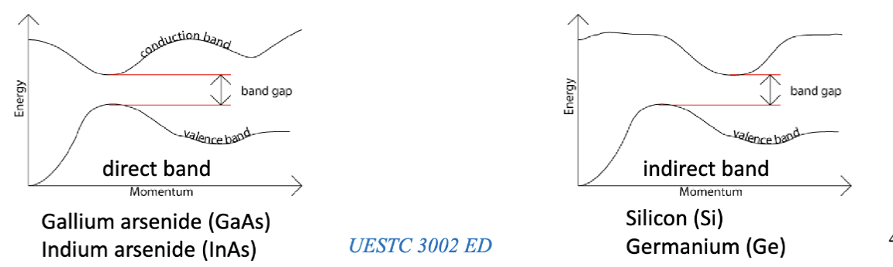

除了 IV 族元素 (如 Si 和 Ge) 之外，III-V 族化合物半导体 (如 GaAs 和 InP) 也非常重要。III-V 族化合物半导体由 III 族元素（如镓 (Ga)、铟 (In)）和 V 族元素（如砷 (As)、磷 (P)）组成。这些材料通常具有较高的电子迁移率和直接带隙，使其在高速电子器件和光电子器件中具有优势。砷化镓 (GaAs) 是一种重要的 III-V 族化合物半导体，其掺杂可以通过改变 Ga 和 As 的比例来实现，从而调节其电学性质。GaAs 具有较高的电子迁移率和直接带隙，适用于高速电子器件和光电子器件。

## 和半导体中的载流子

在 0K 时，半导体材料有填满的价带和空的导带。随着温度的升高，一些电子获得足够的能量跃迁到导带，形成自由电子 (free electrons)，这些电子可以在导带中自由移动，从而使材料具有导电性。价带中的空位称为空穴 (holes)，它们也可以在价带中移动，表现为正电荷载流子。

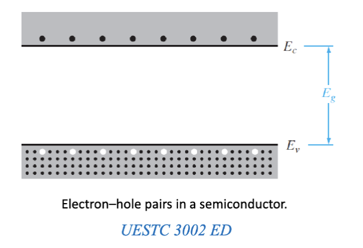

价带和导带之间的能量差称为禁带宽度 (band gap)，用 $E_g$ 表示，为 $E_g = E_c - E_v$。$E_c$ 到真空能级的距离称为电子亲和能 (electron affinity)，用 $\chi$ 表示。$E_v$ 到真空能级的距离称为功函数 (work function)，用 $\phi$ 表示。功函数可以表示为 $\phi = \chi + E_g$。

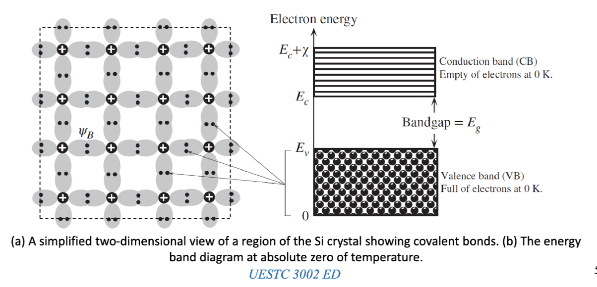

空穴和电子是半导体中负责电流传导的载流子 (charge carriers)。电子在导带中移动，而空穴在价带中移动。空穴的运动实际上是价带中电子的缺失，表现为正电荷载流子。空穴收到的原子核的力比电子强，通常有更低的迁移率 (mobility)。

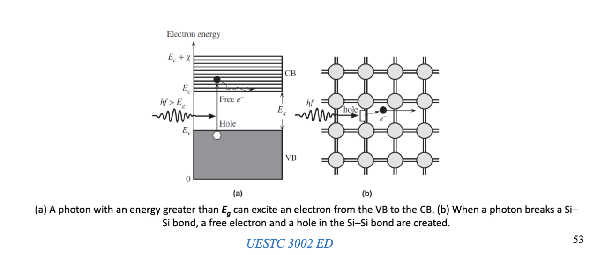

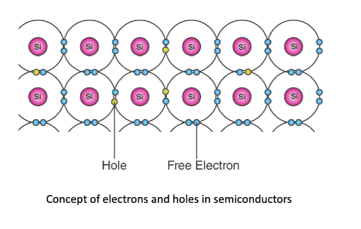

## 不同种类的半导体

- 可以通过掺杂 (doping) 来调节载流子浓度，从而改变材料的导电性。
- 体积更小，重量更轻，功耗更低。
- 电阻率比金属高，但比绝缘体低。
- 半导体的电阻随着温度升高而降低，表现为负温度系数 (negative temperature coefficient)。

本征半导体 (Intrinsic Semiconductor) 是指纯净的半导体材料，没有掺杂任何杂质。在本征半导体中，载流子浓度主要由热激发产生的电子-空穴对决定。随着温度升高，更多的电子获得足够的能量跃迁到导带，形成自由电子和空穴，从而增加了材料的导电性。比如 Si 和 Ge。他们也称为未掺杂半导体 (undoped semiconductor) 或者 i 型半导体 (i-type semiconductor)。

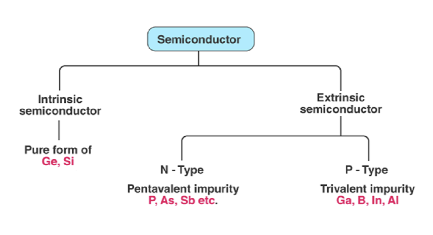

在纯硅晶体中引入少量杂质称为外延半导体 (Extrinsic Semiconductor)。引入少量的替代原子可以显著提高半导体的导电性。添加杂质原子的过程称为掺杂 (doping)。掺杂可以引入额外的电子或空穴，从而改变材料的导电性。掺杂可以分为两种类型：n 型掺杂 (n-type doping) 和 p 型掺杂 (p-type doping)。

n 型掺杂指的是在半导体中引入五价杂质原子（如磷 (P)、砷 (As)），五价杂质原子有一个额外的价电子，这个电子可以很容易地跃迁到导带，形成自由电子，从而增加了材料的导电性。右图是掺入了 1ppm 的 As 后的能带结构。

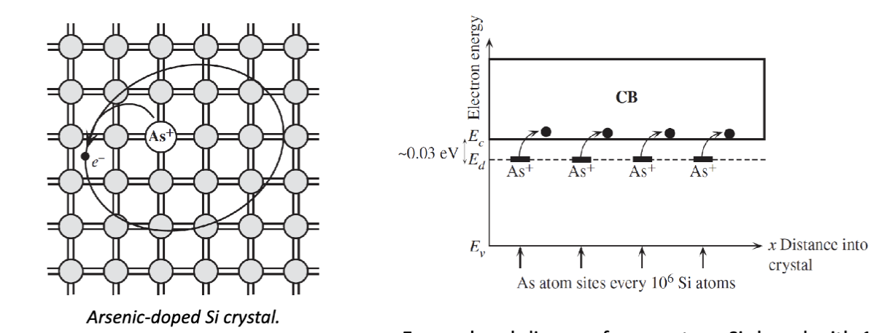

而 p 型掺杂指的是引入三价杂质原子（如硼 (B)、铝 (Al)）。三价杂质原子缺少一个价电子，这个缺失形成了空穴，空穴可以在价带中移动，表现为正电荷载流子，从而也增加了材料的导电性。右图是掺杂了 1ppm 的 B 后的能带结构。

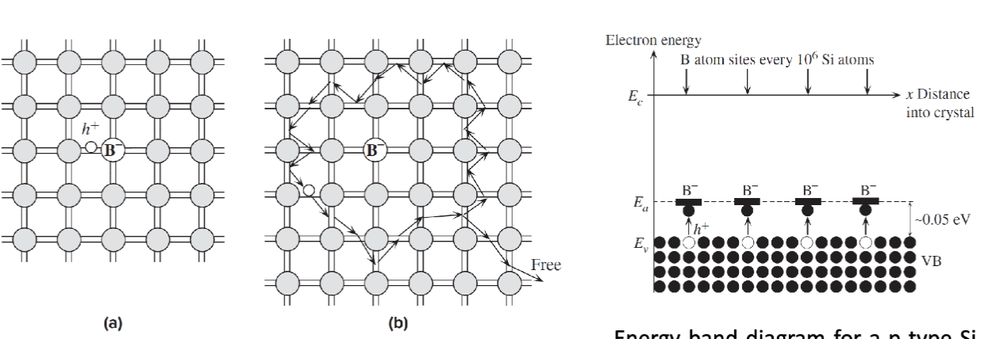

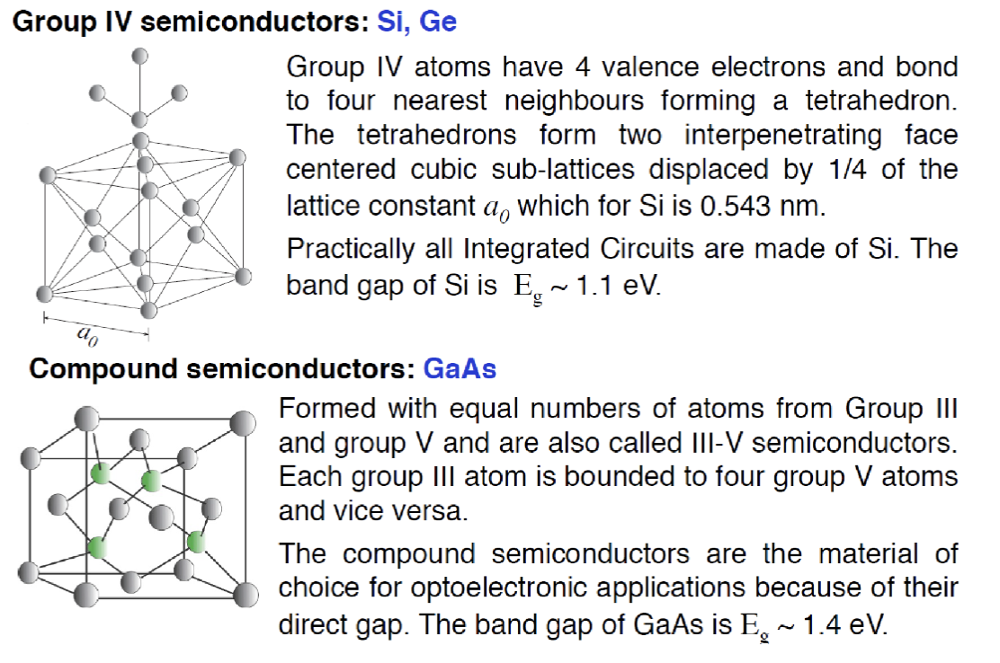

## 泡利不相容原理

泡利不相容原理指出，在一个原子或分子中，两个或多个费米子 (Fermions) 不能占据完全相同的量子态。费米子是指自旋为半整数（如 1/2, 3/2 等）的粒子，包括电子、质子和中子等。这个原理是量子力学的基本原则之一，由沃尔夫冈·泡利 (Wolfgang Pauli) 在 1925 年提出。具体在这里，指的是单个原子中每个电子都应该有独特的状态：只有两个电子可以占据同一个轨道，但它们必须有相反的自旋 (spin)。

硅原子有 14 个电子，电子排布为 $1s^2 2s^2 2p^6 3s^2 3p^2$。根据泡利不相容原理，每个轨道最多可以容纳两个电子，且它们必须有相反的自旋。因此，硅原子的电子排布是稳定的。其中， 3s 和 3p 轨道上的电子是价电子 (valence electrons)，它们决定了硅的化学性质和导电性能。因为 3s 和 3p 能级非常接近，当硅原子相互接近时，四个价电子会形成四个 $sp^3$ 杂化轨道，进而形成四个共价键 (covalent bonds)，使得硅原子能够与其他硅原子结合，形成坚固的晶体结构。

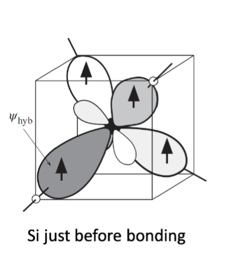

杂化的过程是发生在 $3s$ 和三个 $3p$ 轨道之间的线性组合，形成四个等价的 $sp^3$ 杂化轨道 $\psi_\mathrm{hyb}$。这些杂化轨道有更大的主叶和一个小的后叶，每个杂化轨道都包含一个价电子。四个杂化轨道各有一个价电子，所以是半满结构，这意味着硅原子可以通过共享这些电子与其他硅原子形成共价键，从而形成稳定的晶体结构。

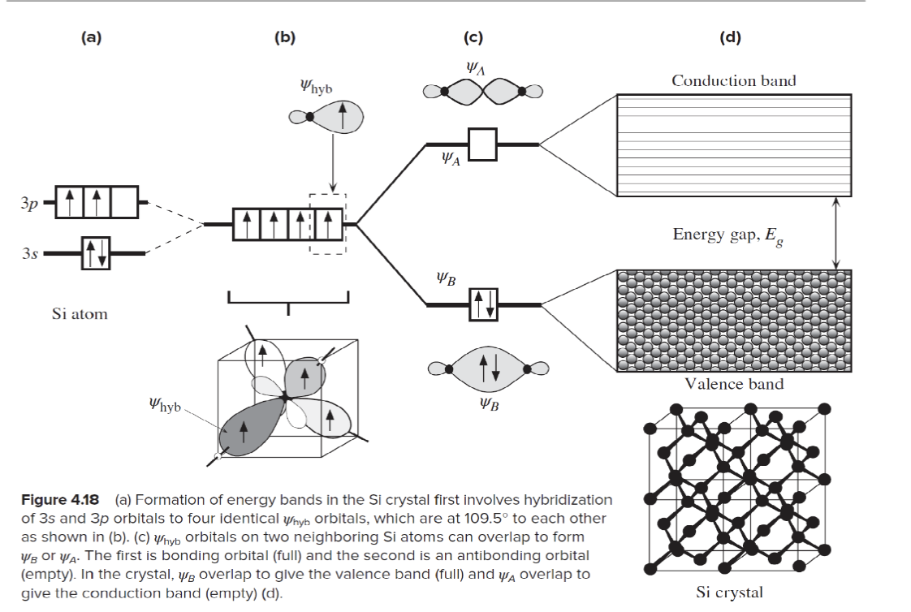
