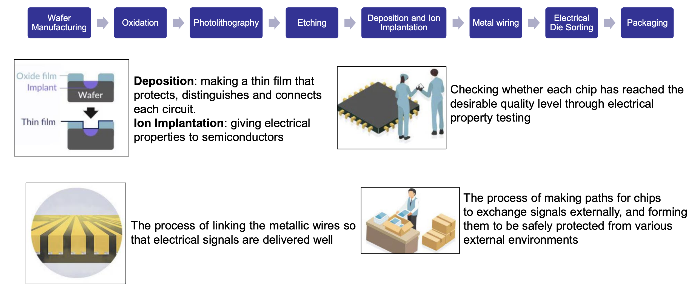
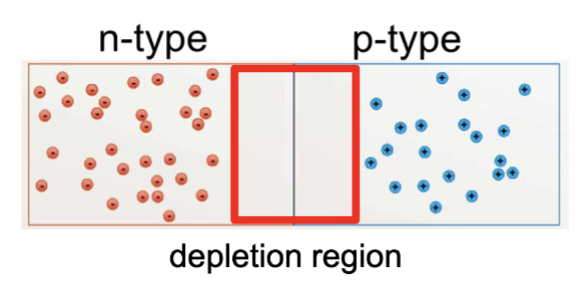
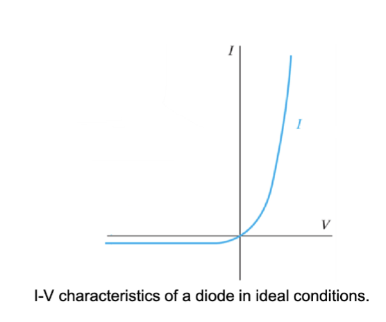

# Lec.2.1 P-N Junction Part.1

## PN 结的制作过程

- 晶圆制造 (Water Manufacturing)
  - 制造高纯度的单晶硅片 (Wafer)
- 氧化 (Oxidation)
  - 在高温下 (1000°C) 将硅片暴露在氧气中，形成一层二氧化硅 (SiO2) 保护层
- 光刻 (Photolithography)
  - 在硅片上画出所需图案
- 蚀刻 (Etching)
  - 使用化学溶液或等离子体去除不需要的材料
- 沉积 (Deposition) & 离子注入 (Ion Implantation)
  - 在硅片上沉积一层薄膜，如多晶硅或金属
  - 通过离子注入将掺杂剂引入硅片，形成 P 型和 N 型区域
- 金属互连 (Metal Wiring)
  - 在硅片上沉积金属层，形成电极和互连
- EDS (Electrical Die Sorting)
  - 测试每个芯片的电性能，确保其符合规格
- 封装 (Packaging)
  - 将芯片封装在保护壳中，便于使用和连接

## PN 结的介绍

在半导体器件中，P-N 结是由 P 型半导体和 N 型半导体接触形成的界面。P 型半导体富含空穴（正电荷载流子），而 N 型半导体富含电子（负电荷载流子）。当 P 型和 N 型材料接触时，电子从 N 型区域扩散到 P 型区域，与空穴复合，形成一个耗尽区（Depletion Region），该区域内几乎没有自由载流子。

其扩散形成了一个内建电场 (Built-in Electric Field)，阻止更多的电子和空穴继续扩散。这个内建电场使得 P-N 结具有整流特性，即允许电流在一个方向上流动，而在相反方向上阻止电流流动。这个电场产生的电势差称为内建电势 (Built-in Potential)。扩散的电荷移动的电流称为扩散电流 (Diffusion Current)，而内建电场驱动的电荷移动的电流称为漂移电流 (Drift Current)。在稳态时，扩散电流和漂移电流相等且方向相反，因此净电流为零。

$$
V_{bi} = V_T \ln \frac{N_A N_D}{n_i^2}
= \frac{kT}{q} \ln \frac{N_A N_D}{n_i^2}
$$

- $V_{bi}$: 内建电势 (Built-in Potential)
- $V_T$: 热电压 (Thermal Voltage)
- $n_i$: 本征载流子浓度 (Intrinsic Carrier Concentration)
- $k = 1.38\times 10^{-23} \mathrm{J/K}$: 玻尔兹曼常数 (Boltzmann Constant)
- $T = 300 \mathrm{K}$: 绝对温度 (Absolute Temperature)
- $q = 1.6\times 10^{-19} \mathrm{C}$: 元电荷 (Elementary Charge)
- $N_A$: 受主浓度 (Acceptor Concentration)
- $N_D$: 施主浓度 (Donor Concentration)

耗尽层的宽度影响着一个二极管的行为，包括其寄生电容和电场的特性。在稳态时，有:

$$
W = \sqrt{
  \frac{2 \varepsilon_0 \varepsilon_r V_{bi}}{q}(
    \frac{1}{N_A} + \frac{1}{N_D}
  )
}
$$

- $W$: 耗尽层宽度 (Depletion Width)
- $\varepsilon_0 = 8.85\times 10^{-14} \mathrm{F/cm}$: 真空介电常数 (Permittivity of Free Space)
- $\varepsilon_r = 11.7$: 硅的相对介电常数 (Relative Permittivity of Silicon)
- 其他符号同上

在稳态时，半导体是电中性的，也就是说，P 型区域的正电荷总量等于 N 型区域的负电荷总量:

$$
N_A W_p = N_D W_n
$$

- $W_p$: P 型区域的耗尽层宽度 (Depletion Width in P-type Region)
- $W_n$: N 型区域的耗尽层宽度 (Depletion Width in N-type Region)
- 其他符号同上

有$N_A >> N_D$，耗尽区基本都在 N 区。因为电荷平衡的倾向，所以电场回让电子从 P 区流向 N 区，空穴从 N 区流向 P 区。

给 PN 结施加外部电压可以控制其内部的电学行为，不同的外部偏置可以改变其耗尽区的宽度。不同的偏执方法有不同的效果：

- 零偏置 (Zero Bias)
  - 没有施加外部电压，PN 结处于平衡状态，耗尽区宽度为 $W$。
- 正向偏置 (Forward Bias)
  - 施加正电压使 P 型区域连接到电源的正极，N 型区域连接到负极。
  - 这会减少耗尽区的宽度，因为外部电压抵消了内建电势，允许更多的载流子通过结。
- 反向偏置 (Reverse Bias)
  - 施加负电压使 P 型区域连接到电源的负极，N 型区域连接到正极。
  - 这会增加耗尽区的宽度，因为外部电压增强了内建电势，阻止载流子通过结。

在施加电压时，几乎所有的输入电压都会落在耗尽区上，因此耗尽区的宽度可以通过以下公式计算：

$$
W = \sqrt{
  \frac{2 \varepsilon_0 \varepsilon_r
  (V_{bi} - V)}{q}(
    \frac{1}{N_A} + \frac{1}{N_D}
  )
}
$$

- $V$: 施加的外部电压 (Applied External Voltage)
- 其他符号同上

耗尽层宽度越小，耗尽层的电势差越小，载流子更容易跨越 PN 结，从而增加电流流动，扩散电流大小也就越大。反之，耗尽层宽度越大，电势差越大，载流子更难跨越 PN 结，减少电流流动。

对于一个理想的二极管，其电流-电压关系可以用肖克利方程 (Shockley Equation) 描述：

$$
I= I_0 (e^{\frac{qV}{kT}} - 1)
$$

- $I$: 二极管电流 (Diode **Current**)
- $I_0$: 反向饱和电流 (Reverse Saturation Current)
- $V$: 施加的外部电压 (Applied External Voltage)
- 其他符号同上

在正向偏置下，电流随着电压的增加呈指数增长，而在反向偏置下，电流接近于 $-I_0$，表示非常小的反向漏电流。
