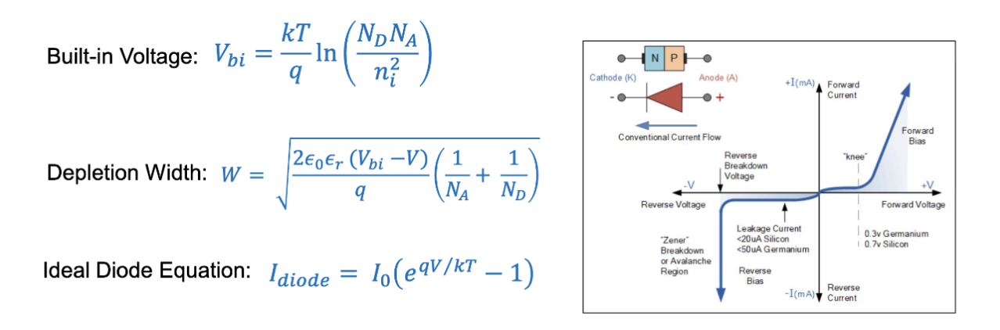
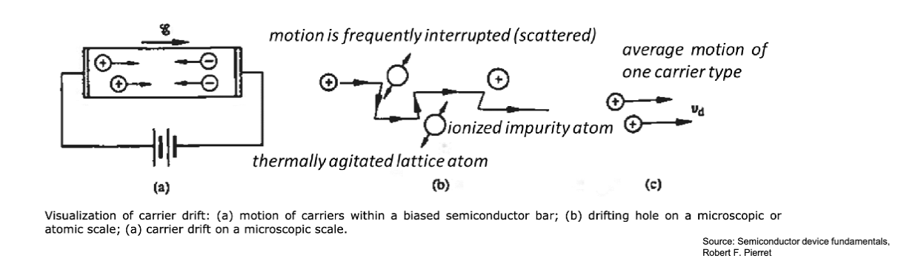
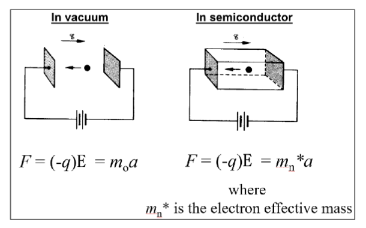
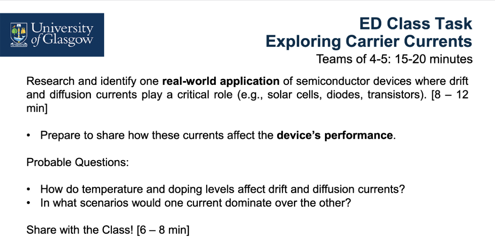

# Lec.2.2 P-N Junction Part.2

## PN 结的结电容

回顾一下 [Lec.2.1](lec2.1.md) 中提到的 PN 结相关的几个公式：

$$
V_{bi} = V_T \ln \frac{N_A N_D}{n_i^2}
= \frac{kT}{q} \ln \frac{N_A N_D}{n_i^2}
$$

$$
W = \sqrt{
  \frac{2 \varepsilon_0 \varepsilon_r
  (V_{bi} - V)}{q}(
    \frac{1}{N_A} + \frac{1}{N_D}
  )
}
$$

$$
I= I_0 (e^{\frac{qV}{kT}} - 1)
$$

在耗尽层的两侧，电荷相互间隔，形成了一个电容器，其电容值可以通过以下公式计算：

$$
C = \frac{\epsilon A}{W}
= A \sqrt{
  \frac{q\epsilon}{2(V_{bi}-V)}
  (\frac{N_D N_A}{N_D + N_A})
}
$$

- $C$: PN 结的结电容 (Junction Capacitance)
- $\epsilon = \varepsilon_0 \varepsilon_r$: 半导体的介电常数 (Permittivity of the Semiconductor)
- $A$: PN 结的面积 (Area of the PN Junction)
- 其他符号同上

在 PN 结中有 $N_A >> N_D$，所以可以简化为：

$$
C = A \sqrt{
  \frac{q\epsilon}{2(V_{bi}-V)}N_D
}
$$

因此，测量二极管中的电容大小是一种间接测量掺杂浓度 $N_D$ 的方法。

## 载流子在电场作用下的运动

在半导体内部，载流子的行为主要分为两种

- 漂移 (Drift)
  - 载流子在电场作用下的运动
  - 例如，在 PN 结的耗尽区内，电场会使电子向 N 区移动，空穴向 P 区移动
- 扩散 (Diffusion)
  - 载流子由于浓度梯度而发生的运动
  - 例如，在 PN 结的两侧，载流子会从高浓度区域扩散到低浓度区域

### 漂移

在施加了外部电场 $E$ 的情况下，电场力会对载流子施加作用力。这个力叠加在电子的随机作用上，可以看作粒子以一个恒定的平均漂移速度运动

施加在粒子上的力的大小为 $F = qE$，引起的加速度大小是 $a=\frac{F}{m}$ 。电场的加速作用同时由粒子的质量和电荷决定，也就是质荷比。在半导体中，质量用 $m*$ 表示，称为 **有效质量 (Effective Mass)**。其由半导体的能带结构决定。

漂移速度 (Drift Velocity) 指的是当施加电场时材料中载流子的速度。在低电场下有公式:

$$
v = \mu E
$$

其中， $\mu$ 是载流子的迁移率 (Mobility)，表示载流子在电场作用下的响应能力。迁移率的单位是 $cm^2/Vs$。在半导体材料中，电子和空穴的迁移率 $\mu_e$ 和 $\mu_h$ 通常不同，通常取决于温度、掺杂浓度和其他因素等。

漂移电流密度 (Drift Current Density) 指的是由于电场的影响，半导体中的载流子的运动引起的单位面积的电流的流动。对于电子和空穴，漂移电流密度可以表示为：

$$
\begin{align}
  & J_n = qnv_D = qn\mu_n E \quad \text{(电子的漂移电流密度)} \\
  & J_p = qpv_D = qp\mu_p E \quad \text{(空穴的漂移电流密度)}
\end{align}
$$

总的漂移电流密度为：

$$
J_{drift} = J_n + J_p = q(n\mu_n + p\mu_p)E
$$

### 扩散

扩散 (Diffusion) 指的是载流子的热运动引起的，从高浓度区域向低浓度区域的净移动过程。这种现象是由于载流子在材料中的随机热运动所导致的。在半导体中，扩散电流密度 (Diffusion Current Density, $J$ ) 可以用菲克定律 (Fick's Law) 来描述：

$$
\begin{aligned}
  & J_{n,\mathrm{diffusion}} = -qD_n \frac{dn}{dx} \quad \text{(电子的扩散电流密度)}\\
  & J_{p,\mathrm{diffusion}} = qD_p \frac{dp}{dx} \quad \text{(空穴的扩散电流密度)s}
\end{aligned}
$$

从公式可以看出，扩散电流大小取决于浓度梯度大小和相应的载流子的扩散系数。其中， $\frac{dn}{dx}$ 和 $\frac{dp}{dx}$ 分别表示电子和空穴浓度关于位置 $x$ 的变化率， $D_n$ 和 $D_p$ 分别是电子和空穴的扩散系数，单位是 $cm^2/s$ 。

扩散系数 (Diffusion Coefficient, $D_n$ 和 $D_p$ ) 描述了载流子在浓度梯度作用下在材料中扩散的难易程度。其与迁移率之间存在爱因斯坦关系 (Einstein Relation)：

$$
\begin{aligned}
  & D_n = \mu_n \frac{kT}{q} \quad \text{(电子的扩散系数)}\\
  & D_p = \mu_p \frac{kT}{q} \quad \text{(空穴的扩散系数)}
\end{aligned}
$$

两者都取决于载流子迁移率 $\mu_n$ 和 $\mu_p$ 以及温度 $T$ 。更高的迁移率会导致更高的扩散率。这种关系将载流子的热运动（也就是扩散）和其对电场的响应（也就是迁移）联系起来。

### 总载流子电流

半导体中的总载流子电流密度 (Total Carrier Current Density) 是漂移电流密度和扩散电流密度的总和。对于电子和空穴，净载流子电流密度可以表示为：

$$
\begin{aligned}
  J & = J_n + J_p \\
   &= J_{n,\mathrm{drift}} + J_{n,\mathrm{diffusion}}\\
   & \quad +J_{p,\mathrm{drift}} + J_{p,\mathrm{diffusion}} \\
\end{aligned}
$$

## 电导率和电阻率

电导率 (Conductivity, $\sigma$ ) 指的是电流密度 $J$ 与施加在材料上的电场大小 $E$ 之间的比例系数。半导体的总电导率的计算方式是：

$$
\sigma = q(n\mu_n + p\mu_p)
$$

其中， $n$ 和 $p$ 分别是材料中电子和空穴的浓度， $\mu_n$ 和 $\mu_p$ 分别是电子和空穴的迁移率。

对应的，电阻率 (Resistivity, $\rho$ ) 是电导率的倒数，它衡量得失材料对电流流动的阻碍程度。它受载流子数量以及其在材料中的移动难易程度，也就是迁移率的影响。电阻率的计算方式是：

$$
\rho = \frac{1}{\sigma} = \frac{1}{q(n\mu_n + p\mu_p)}
$$

---

但是，怎么确定电子浓度和空穴浓度？

过程涉及到态密度 (Density of States, $g_\mathrm{cb}(E)$ ) 和状态占据概率 (Occupation Probability, $f(E)$ )。最终的计算方式是将二者相乘并积分：

$$
\begin{aligned}
   n & = \int_{E_c}^{E_c +x} n_E(E) dE\\
   & = \int_{E_c}^{E_c +x} g_\mathrm{cb}(E) f(E) dE
\end{aligned}
$$

在此处， $E_c$ 是导带的底部能级， $x$ 是一个足够大的能量范围，确保包含了所有可能的电子态。通过这个积分，我们可以计算出在给定条件下材料中的电子浓度 $n$ 。

此处费米函数 (Fermi Function) $f(E)$ 描述了占据可用能级的概率:

$$
f(E) = \frac{1}{\exp{\frac{E-E_F}{kT}}+1}
$$

其中， $E_F$ 是费米能级 (Fermi Level)，表示在绝对零度下电子填充到的最高能级。 $k$ 是玻尔兹曼常数， $T$ 是绝对温度。

而态密度的定义是可用能级的数量，进而决定有多少电子可以到达导带。其计算方式为:

$$
g_{\mathrm{cb}}(E) = \frac{(\pi 8\sqrt{2})m_e^{* \frac{3}{2}}}{h^3} \sqrt{E-E_c}
$$

其中， $m_e^*$ 是电子的有效质量， $h$ 是普朗克常数， $E_c$ 是导带的底部能级。

把这些定义带入上述的积分公式中，可以计算出材料中的电子浓度 $n$ 。类似地，可以通过类似的积分计算出空穴浓度 $p$ 。

$$
\begin{aligned}
  n & \approx \frac{(\pi 8\sqrt{2})m_e^{*\frac{3}{2}}}{h^3}\int_{E_c}^{\infty}\sqrt{E-E_c}\exp[-\frac{E-E_F}{kT}] dE \\
  & = N_c \exp[-\frac{E_c - E_F}{kT}] \\
\end{aligned}
$$

这里有

$$
  N_c = 2(\frac{2\pi m_e^* kT}{h^2})^{\frac{3}{2}}
$$

这里电子的有效质量 $m_e^*$ 值是 $9.1\times 10^{-31} \mathrm{kg}$。 $N_c$ 被称为导带有效态密度 (Effective Density of States in the Conduction Band)，表示在导带中可用的电子态的数量。

---

可以对价带中的空穴密度进行类似的计算。将价带中的态密度 $g_{vb}(E)$ 和费米函数 $f(E)$ 与 1 的差相乘并积分，得到空穴浓度 $p$：

$$
p = \int_0^{E_v} p_E dE = \int_0^{E_v} g_{vb}(E) [1 - f(E)] dE
$$

因为电子缺失的概率是 $p$，同时也是单位能量中的空穴浓度。而电子出现的概率是 $f(E)$，所以 $1 - f(E)$ 就是空穴出现的概率。

假定 $E_F$ 比 $E_v$ 高几个 $kT$，可以得到近似解：

$$
p = N_v \exp[-\frac{E_F - E_v}{kT}]
$$

这里有

$$
N_v = 2(\frac{2\pi m_h^* kT}{h^2})^{\frac{3}{2}}
$$

$N_v$ 被称为价带有效态密度 (Effective Density of States in the Valence Band)，表示在价带中可用的空穴态的数量。 $m_h^*$ 是空穴的有效质量。

---

使用空穴密度和电子密度的表达式，计算出本征载流子浓度 (Intrinsic Carrier Concentration)：

$$
\begin{aligned}
  np & = n_i^2 \\
    & = N_c \exp[-\frac{E_c - E_F}{kT}] \times N_v \exp[-\frac{E_F - E_v}{kT}] \\
    & = N_c N_v \exp[-\frac{E_c - E_v}{kT}] \\
    & = N_c N_v \exp(-\frac{E_g}{kT}) \\

\end{aligned}
$$

本征半导体是一种纯净的半导体晶体，电子和空穴对浓度相同，几乎不含杂质，费米能级位于禁带中间。此处的 $n_i$ 就是本征载流子浓度。

> 已严肃被绕晕

---

> 课上练习：
>
> 
