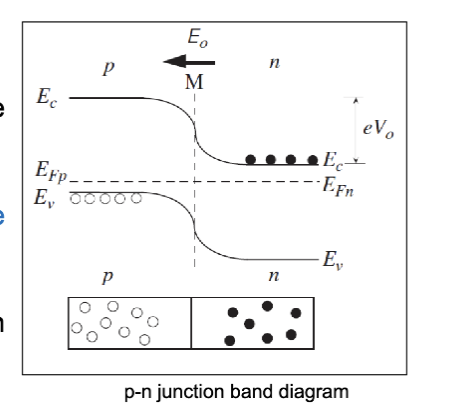
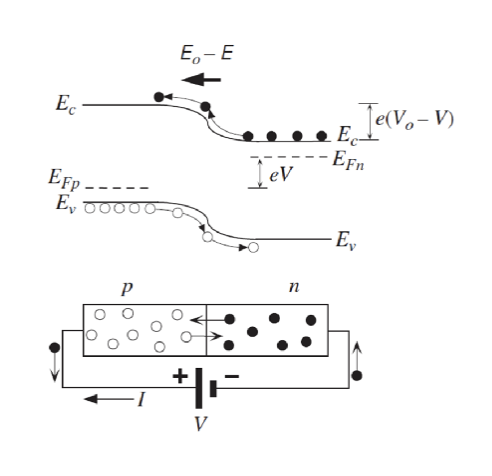
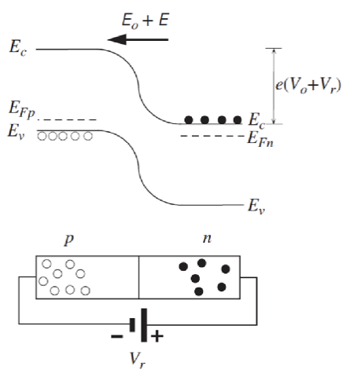
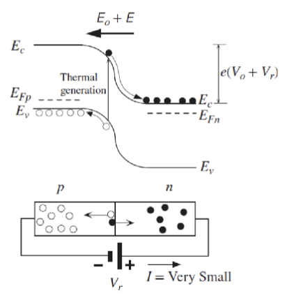
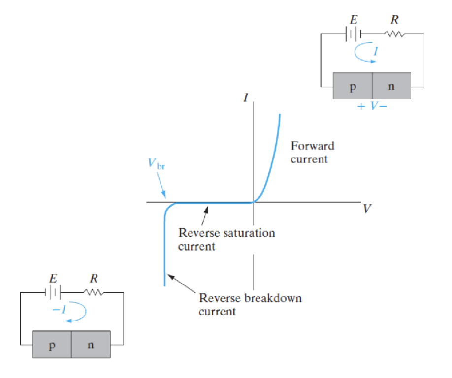
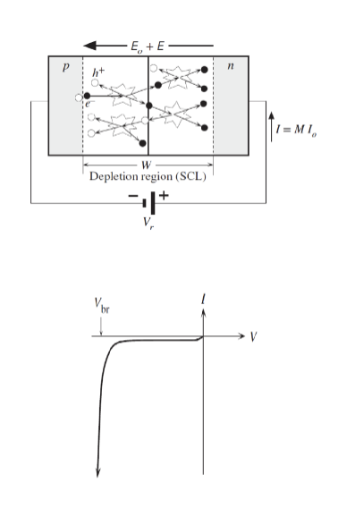

# Lec.2.3 P-N Junction Part.3

## PN 结的能带图

由于扩散效应，能带会在 PN 结处弯曲，形成势垒。导带和价带的 n 型区域（N 区）相对于 p 型区域（P 区）更低。如果电流想要流动，电子必须克服这个势垒。

在两侧的费米能级必须相等。这是热力学平衡的要求。

在正向偏置时，施加的电压和内建电势相反，让势垒降低，更多的载流子能够进入结中，耗尽区变窄，电流增大。两侧费米能级不对齐，n 区的费米能级高于 p 区的费米能级。两者的差值大小等于外加电压做功 $eV$。

在反向偏置时，施加的电压和内建电势同向，让势垒增大，载流子更难进入结中，耗尽区变宽，电流减小。在这种情况下，只有少数载流子会对微小的反向饱和电流做出贡献。故电流大小几乎不受反向偏置电压的影响。

热生成 (Thermal Generation) 是指在热激发下，价带中的电子获得足够的能量跃迁到导带，形成电子-空穴对的过程。这个过程在 PN 结中尤为重要，因为它是反向饱和电流的主要来源。

反向击穿 (Reverse Breakdown) 是指在反向偏置下，PN 结中的电场强度增大到一定程度，导致载流子获得足够的能量，产生雪崩效应或隧穿效应，从而引发大量载流子流动，导致电流急剧增加的现象。

在耗尽区的电场变得非常大，以至于这个区域内的漂移电流中的电子获得足够的动能，能够碰撞电离晶格中的原子，产生更多的电子-空穴对。这种连锁反应导致电流迅速增加，称为雪崩击穿 (Avalanche Breakdown)。

齐纳击穿指的是在重掺杂的 PN 结中，由于能带弯曲剧烈，导致价带和导带在耗尽区内非常接近，甚至重叠。这样，电子可以通过量子隧穿效应直接从价带跃迁到导带，形成大量载流子流动，导致电流急剧增加的现象。这种情况下产生电流的现象叫做齐纳效应 (Zener Effect)。齐纳效应对于齐纳二极管的运行至关重要，因为它允许二极管在特定的反向电压下稳定工作，起到稳压的作用。
