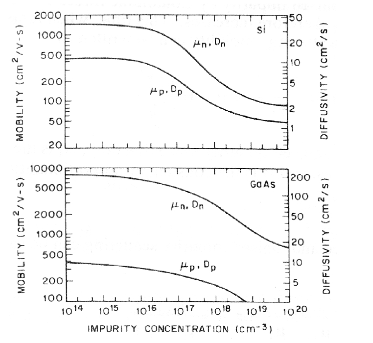
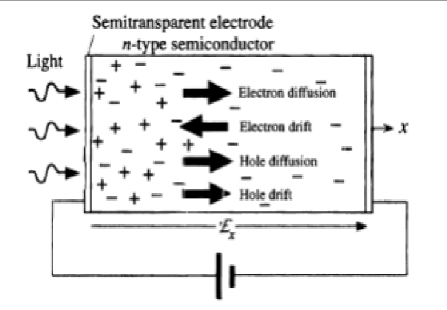
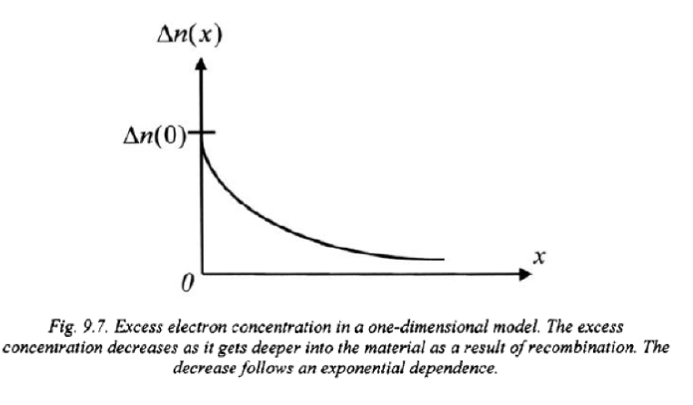
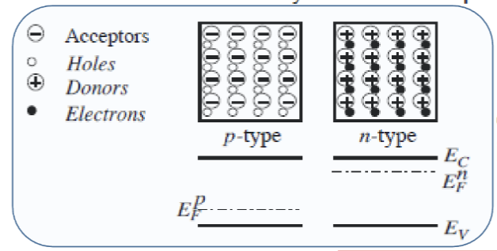
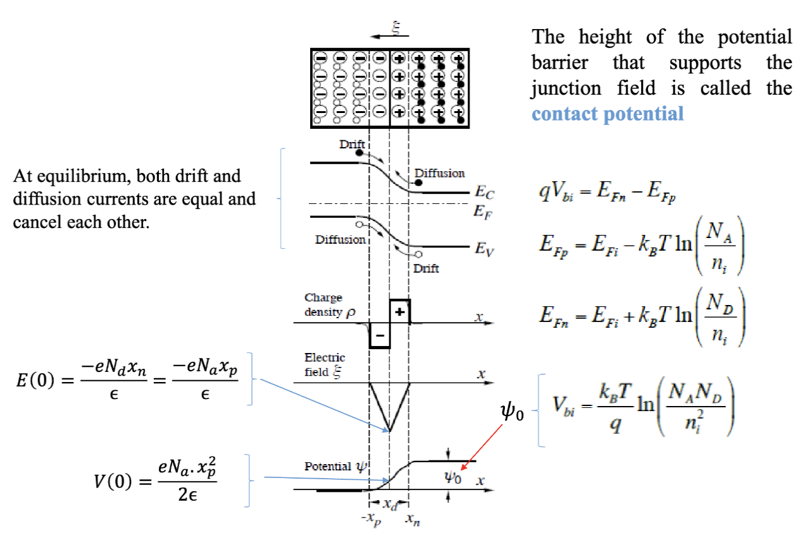
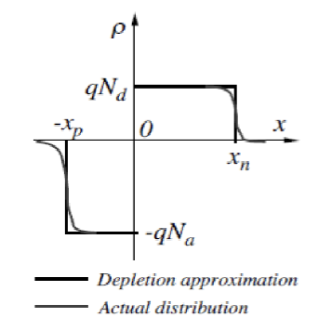
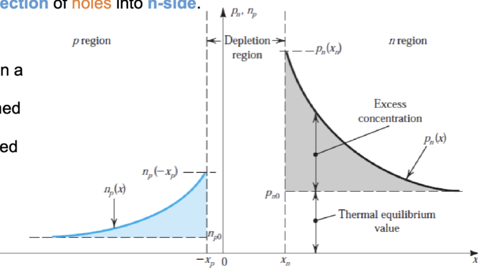
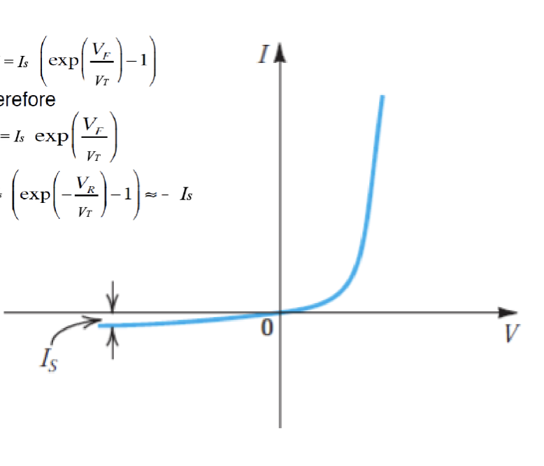

# Lec.2.4 P-N Junction Part.4

## 复合 (Recombination)

这两张图展示了电子和空穴在两种半导体材料 (Si 和 GaAs) 中的移动性随着掺杂浓度的变化情况。在 GaAs 中，有效质量更小，进而在相同的杂质浓度下有了更高的 $\mu_n$ 和 $\mu_p$。

在[之前](lec2.2.md#电导率和电阻率)提到了半导体中的总电流是电子和空穴电流的总和：

$$
J = J_n + J_p = J_{n,drift} + J_{n,diff} + J_{p,drift} + J_{p,diff}
$$

在发生扩散的过程中，电子会发生复合 (Recombination)，也就是电子和空穴相遇的时候。电子和空穴结合会生成中性的原子，从而减少了自由载流子 (Free Carrier) 的数量。

通常会使用一个特征的时间 $\tau$ 来表示复合效应，成为电子复合寿命 (Electron Recombination Lifetime)。之后可以给根据电子和空穴的寿命来定义扩散长度 (Diffusion Length)：

$$
\begin{aligned}
  L_p = \sqrt{D_p \tau_p} \\
  L_n = \sqrt{D_n \tau_n}
\end{aligned}
$$

这里的 $L_p$ 和 $L_n$ 分别表示空穴和电子的扩散长度。扩散长度表示载流子在复合之前可以移动的平均距离。

## 耗尽电容 (Depletion Capacitance)

如果一开始让 PN 结的两部分分开，两部分都是电中性的。p 区里已电离的受主（负电荷）被空穴（正电荷）抵消，n 区里已电离的施主（正电荷）被电子（负电荷）抵消。这个时候

$$
\begin{aligned}
  n & \approx N_D = n_i \exp(\frac{E_F^n - E_i}{k_B T}) \\
  p & \approx N_A = n_i \exp(\frac{E_i - E_F^p}{k_B T})
\end{aligned}
$$

这个时候，两侧的费米能级的距离是

$$
E_F^n - E_F^p = k_B T \ln(\frac{N_A N_D}{n_i^2})
$$

其中， $E_F^n$ 和 $E_F^p$ 分别是 n 区和 p 区的费米能级， $N_D$ 和 $N_A$ 分别是施主和受主的掺杂浓度， $n_i$ 是本征载流子浓度。

在两侧接触后，电子会从 n 区扩散到 p 区，空穴会从 p 区扩散到 n 区。由于载流子的扩散，导致两侧靠近接触面的区域出现了电荷不平衡的现象。在 n 区靠近接触面的区域，有多余的正电荷（已电离的施主），而在 p 区靠近接触面的区域，有多余的负电荷（已电离的受主）。这些多余的电荷形成了空间电荷区 (Space Charge Region)，也称为耗尽区 (Depletion Region)。

在平衡状态下，漂移电流和扩散电流相互抵消，PN 结內产生了一个内建电势 (Built-in Potential) $V_{bi}$。支持这个结电场的势垒高度被称为接触电势 (Contact Potential)。

由于达到了平衡状态，耗尽区内没有移动载流子。在耗尽近似 (Depletion Approximation) 下，区域内的电荷密度等于已电离的受主或者施主的电荷密度。

为了求出 $x_p$ 和 $x_n$，也就是耗尽区在 p 区和 n 区的宽度，可以使用泊松方程 (Poisson's Equation)：

$$
\begin{aligned}
  x_N &= \sqrt{\frac{
  2 \varepsilon_0 \varepsilon_s (\psi_0 + V) N_A
  }{
    q N_D (N_A + N_D)
  }} \\
  x_P &= \sqrt{\frac{
  2 \varepsilon_0 \varepsilon_s (\psi_0 + V) N_D
  }{
    q N_A (N_A + N_D)
  }}
\end{aligned}
$$

其中， $\varepsilon_0$ 是真空介电常数， $\varepsilon_s$ 是半导体的相对介电常数， $q$ 是基本电荷量， $V$ 是外加电压， $\psi_0$ 是内建电势，也就是 $V_{bi}$。

所以，耗尽区的总宽度是

$$
w = x_n + x_p = \sqrt{\frac{
  2 \varepsilon_0 \varepsilon_s (\psi_0 + V)
  }{
    q
  } \left(\frac{1}{N_A} + \frac{1}{N_D}\right)}
$$

因此，空间电荷层中的小信号电容，可以用这个公式来表示:

$$
C = \frac{dQ}{dV_R}
$$

这里， $Q$ 是耗尽区内的单极电荷总量

$$
\begin{aligned}
  Q& = q A N_D x_n = q A N_A x_p \\
  & = A\sqrt{\frac{
    sq\varepsilon_0 \varepsilon_s
    (\psi_0 + V_R)N_A N_D
  }{
    N_A + N_D
  }}
\end{aligned}
$$

化简，可以得到，二极管的耗尽电容大小为

$$
C = A\sqrt{\frac{
  q \varepsilon_0 \varepsilon_s N_A N_D
}{
  2 (\psi_0 + V_R)(N_A + N_D)
}}
$$

## 伏安特性 (I-V Characteristics)

在平衡状态下，电子电流的漂移和扩散分量方向相反，大小相同，净电流大小为零。对于空穴也如此。

在外部施加正向偏置时，耗尽区减小，电场减小，进而漂移电流减小。有外部电子注入到 p 区，空穴注入到 n 区。净电流不为零，形成正向电流。

由于电流的特性，通过一个元件的电流应该是处处相等的。所以在 PN 结的任意位置，电子电流和空穴电流的总和应该是相等的：

$$
I(x) = I_n(x) + I_p(x) = C \quad \text{常数}
$$

这个关系叫做肖克利关系 (Shockley Relationship)。这意味着，在远离耗尽区边缘的区域，少数载流子的扩散电流会逐渐通过复合过程变成多数载流子的漂移电流。

---

当空穴扩散到 n 区时，有:

$$
\begin{aligned}
  p_n(x) & = p_{n0} + p_{n0}(e^\frac{V}{V_T}-1)e^{-\frac{x - x_n}{L_p}} \\
  J_p(x) & = -\frac{q D_p p_{n}(x)}{dx} \\
  & = q (\frac{D_p}{L_p})p_{n0}(e^\frac{V}{V_T}-1)e^{-\frac{x - x_n}{L_p}} \\
  J_p(x_n) & = q (\frac{D_p}{L_p})p_{n0}(e^\frac{V}{V_T}-1)
\end{aligned}
$$

同样得到电子在 p 区的扩散电流为:

$$
J_n(-x_p) = q(\frac{D_n}{L_n})n_{p0}(e^\frac{V}{V_T}-1)
$$

这种情况下，总电流大小为

$$
\begin{aligned}
  I &= A(J_n + J_p) \\
  &= Aq(\frac{D_p}{L_p}p_{n0} + \frac{D_n}{L_n}n_{p0})(e^\frac{V}{V_T}-1) \\
  &= Aqn_i^2(\frac{D_p}{L_p N_D} + \frac{D_n}{L_n N_A})(e^\frac{V}{V_T}-1) \\
\end{aligned}
$$

提取出一个饱和电流 (Saturation Current) $I_S$，可以得到 PN 结的 I-V 特性方程：

$$
\begin{aligned}
  I_S & = Aqn_i^2(\frac{D_p}{L_p N_D} + \frac{D_n}{L_n N_A}) \\
  I & = I_S (e^\frac{V}{V_T}-1)
\end{aligned}
$$

最终得到了著名的肖克利方程 (Shockley Equation)。这里的 $I_S$ 同时也是反向偏置时的电流大小。

---

总计一下上文提到的一堆公式，最终得到的是这样的结果：

在 n 区，空穴浓度分布为：

$$
p_n(x)=\big(p_n(x_n)-p_{n0}\big)\exp\!\left(-\frac{x-x_n}{L_p}\right)+p_{n0}
$$

在 p 区，电子浓度分布为：

$$
n_p(x)=\big(n_p(-x_p)-n_{p0}\big)\exp\!\left(\frac{x+x_p}{L_n}\right)+n_{p0}
$$

其中 $L_p, L_n$ 是少数载流子的扩散长度。少数载流子的扩散电流为：

$$
\begin{aligned}
& I_p(x)=-qAD_p\frac{dp_n(x)}{dx}=qA\frac{D_p}{L_p}\big(p_n(x_n)-p_{n0}\big)\exp\!\left(-\frac{x-x_n}{L_p}\right)\\
& I_n(x)=qA\frac{D_n}{L_n}\big(n_p(-x_p)-n_{p0}\big)\exp\!\left(\frac{x+x_p}{L_n}\right)
\end{aligned}
$$

在耗尽层边缘处且处于低注入水平时，有：

$$
n_p(-x_p)=n_{p0}\exp\!\left(\frac{V_F}{V_T}\right),\quad p_n(x_n)=p_{n0}\exp\!\left(\frac{V_F}{V_T}\right)
$$

且 $V_T=\frac{k_B T}{q}$。

因此，耗尽层边缘的少数载流子电流为：

$$
\begin{aligned}
  & I_p(x_n)=qA\frac{D_p}{L_p} p_{n0}\big(\exp\!\left(\frac{V_F}{V_T}\right)-1\big) \\
  & I_n(-x_p)=qA\frac{D_n}{L_n}n_{p0}\big(\exp\!\left(\frac{V_F}{V_T}\right)-1\big)
\end{aligned}
$$

最终，PN 结的总电流为：

$$
I = I_S(exp(\frac{V_F}{V_T})-1)
$$

通常，在 $exp(\frac{V_F}{V_T}) \gg 1$ 时，可以近似为：

$$
I \approx I_S exp(\frac{V_F}{V_T})
$$

在反向偏置时，有

$$
I \approx -I_S
$$

