# 双极晶体管

## 晶体管的分类

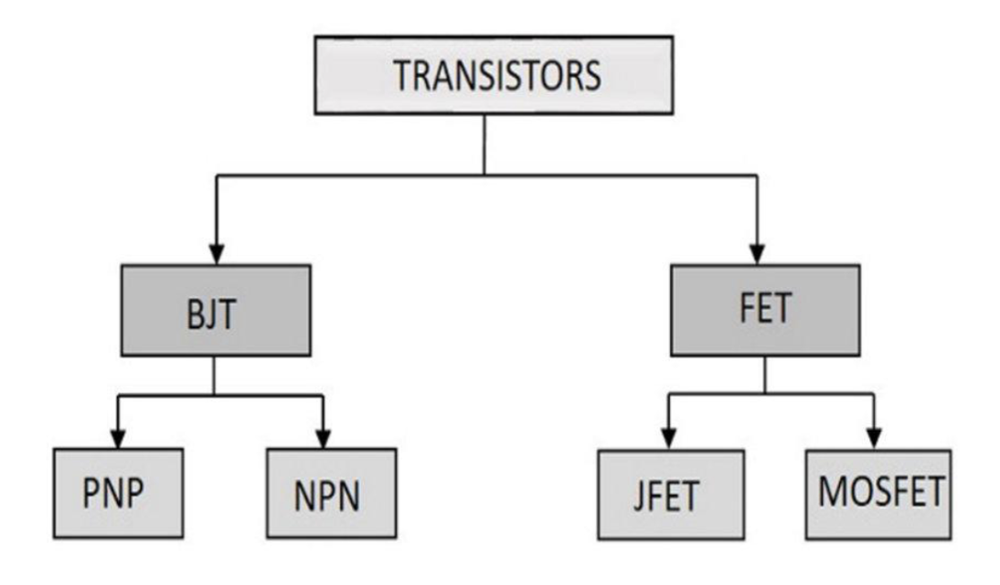

晶体管可以分成两个大类: BJT (Bipolar Junction Transistor) 和 FET (Field Effect Transistor)，即双极结型晶体管和场效应晶体管。BJT 可以分为 PNP 和 NPN 两种类型，而 FET 则可以分为 JFET (结型场效应晶体管) 和 MOSFET (金属氧化物半导体场效应晶体管)。

## 双极晶体管概述

BJT 最早在 1948 年于贝尔实验室发明，被用于多种电子设备。其主要被用于放大和开关电路中。

BJT 的结构可以看作是两个二极管的组合，两个二极管共享了一个公共区域，称为基极 (Base)。另外两个区域分别称为发射极 (Emitter) 和集电极 (Collector)。共享的区域可以是二极管的 N 区或 P 区，形成 NPN 或 PNP 结构，分别构成 NPN 型和 PNP 型晶体管。

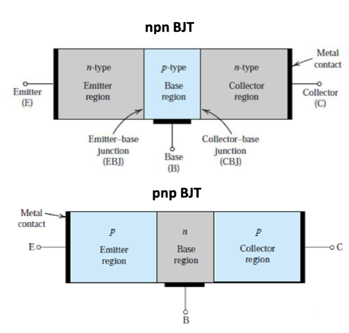

其电路图符号以及典型的工作场景如下：

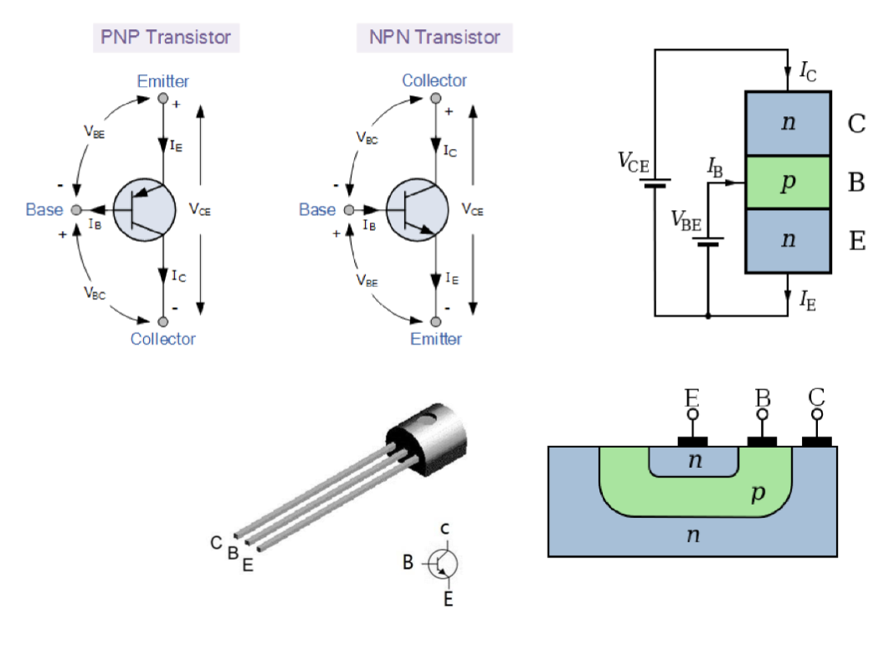

BJT 一共有四种工作模式，分别是饱和 (Saturation)、正向放大 (Forward Active)、截止 (Cut-off) 和反向(Reverse) 模式。不同的工作模式对应不同的偏置条件：

| 工作模式                  | 发射结偏置 | 集电结偏置 |
| ------------------------- | ---------- | ---------- |
| 饱和 (Saturation)         | 正向       | 正向       |
| 正向放大 (Forward Active) | 正向       | 反向       |
| 截止 (Cut-off)            | 反向       | 反向       |
| 反向 (Reverse)            | 反向       | 正向       |

通常，BJT 会工作在正向放大模式下，此时发射结为正向偏置，集电结为反向偏置。

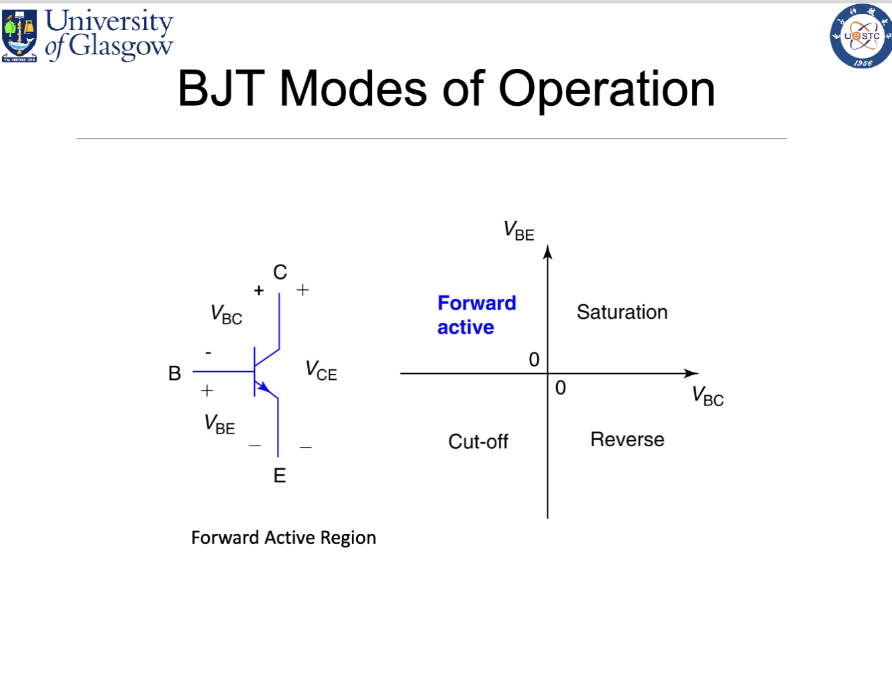

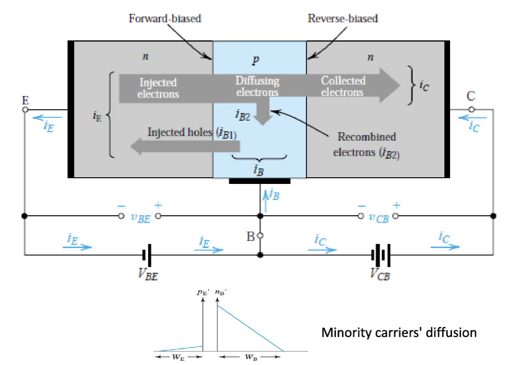

在正向放大过程中，电流从集电极流入，经过基极，最终流出发射极。基极电流 (I_B) 控制着集电极电流 (I_C) 和发射极电流 (I_E) 的大小。最终从发射极流出的电流是集电极电流和基极电流之和。

最终， $I_C$，也就是集电极电流大小是一个关于 $V_{BE}$ 的指数函数，而与 $V_{CB}$ 几乎无关。

---

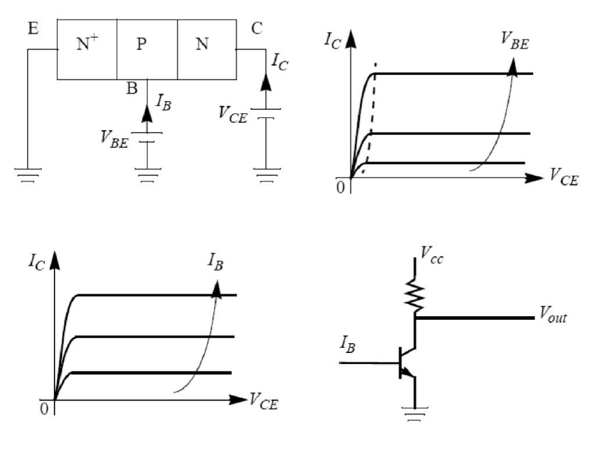

图上展示的是一种共发射极的配置。其中，发射极接地作为参考点，而基极好集电极的施加电压都是相对于发射极而言的。

可以发现，在 $V_{CE}$ 刚开始增长时，$I_C$ 会迅速增加，这个阶段称为“饱和区”。当 $V_{CE}$ 继续增加时，$I_C$ 会趋于平稳，这个阶段称为“放大区”或“线性区”。在这个区域内，$I_C$ 主要由 $V_{BE}$ (或者说输入电流 $I_B$) 决定。在 $V_{CE}$ 继续增长到了一定程度后，晶体管进入“击穿区”，$I_C$ 会再次迅速增加。

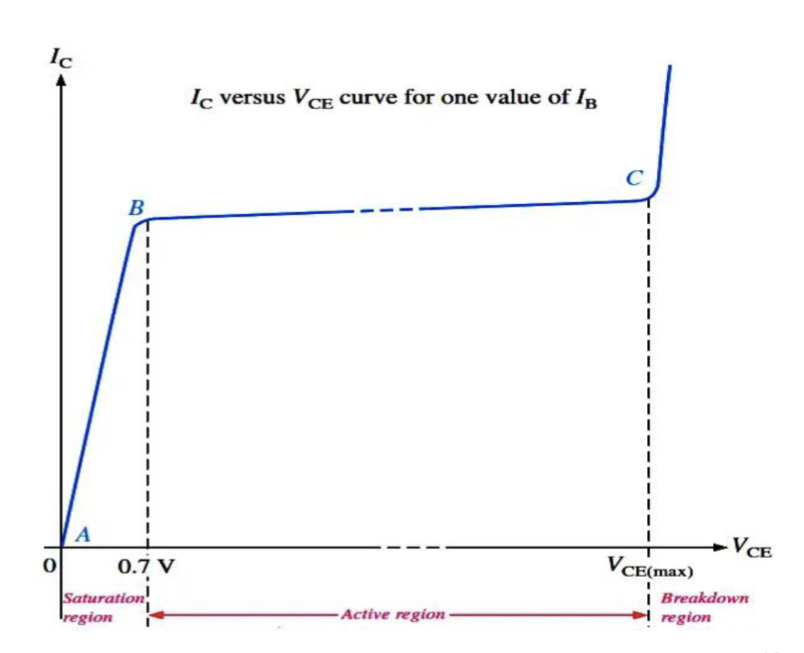

## 电流 & 增益

集电极电流可以通过这个公式给出:

$$
\begin{aligned}
  I_C & = I_S (\exp(q\frac{V_{BE}}{kT})-1)\\
& =A_E q \frac{D_B}{W_B} \frac{n_{iB}^2}{N_B}(exp(q\frac{V_{BE}}{kT})-1)
\end{aligned}
$$

其中，$D_B$ 是基区的电子扩散系数，$W_B$ 是基区的宽度，$N_B$ 是基区的掺杂浓度，$n_{iB}$ 是基区的本征载流子浓度，$A_E$ 是发射结的横截面积。

虽然主要电流是电子从发射极（N 区）流向基极（P 区），但同时也存在空穴从基极（P 区）注入到发射极（N+区）的现象。这些空穴必须由基极电源提供，因此它们构成了基极电流 $I_B$ 的主要部分。

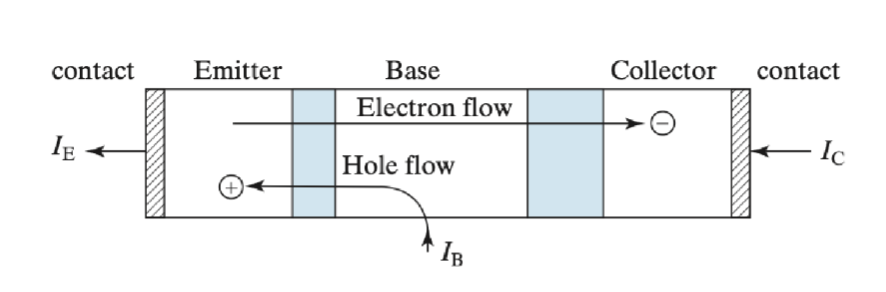

对于一个均匀的发射极，有：

$$
I_B = A_E q \frac{D_E n_{iE}^2}{W_E N_E} (e^{qV_{BE}/kT} - 1)
$$

其中，$D_E$ 是发射区空穴扩散系数，$W_E$ 是发射区宽度，$N_E$ 是发射区掺杂浓度。

观察一下 $I_C$ 和 $I_B$ 的表达式，可以发现二者似乎都与 $e^{qV_{BE}/kT}$ 成正比。因此，我们可以定义一个参数 $\beta_F$，表示集电极电流与基极电流之比：

$$
\beta_F = \frac{I_C}{I_B}
$$

这里的 $\beta_F$ 称为共发射极电流增益 (Common-Emitter Current Gain)，指的是集电极电流与基极电流之比。类似的，还有共基极电流增益 (Common-Base Current Gain) $\alpha_F$，定义为：

$$
\begin{aligned}
  & I_C = \alpha_F I_E \\
  & \alpha_F = \frac{I_C}{I_E} = \frac{I_C}{I_B + I_C} = \frac{\beta_F}{1+\beta_F}
\end{aligned}
$$

将 $I_C$ 和 $I_B$ 的表达式代入 $\beta_F$ 的定义，可以得到：

$$
\beta_F = \frac{G_E}{G_B} = \frac{D_BW_EN_En_{iB}^2}{D_EN_BW_Bn_{iE}^2}
$$

> 示例计算：
>
> 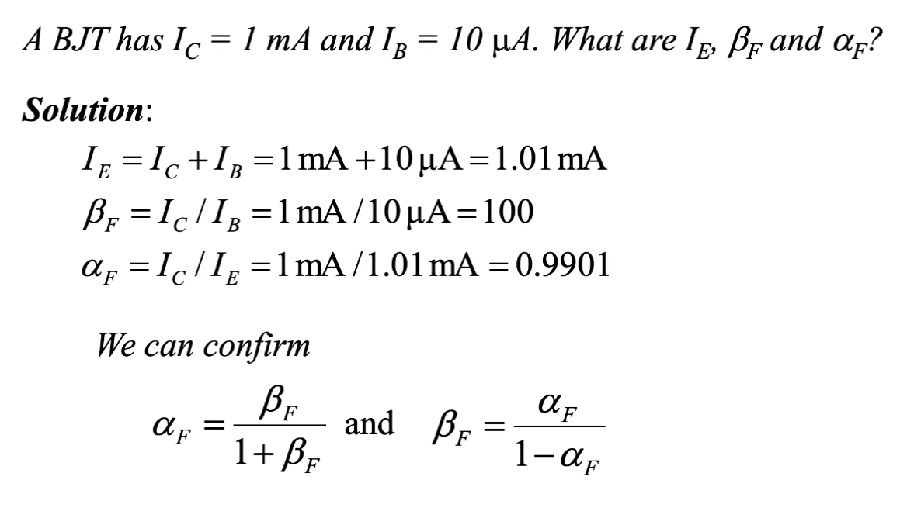

---

## 功耗

功耗的计算公式为 $P = V \cdot I$ 。对于 BJT，我们有不同的电流和电压需要考虑，总功率同时需要考虑 $I_B$ 和 $I_C$ 以及它们对应的电压：

$$
P = V_{BE} I_B + V_{CE} I_C
$$

因为有 $I_C = \beta_F I_B$，并且通常 $\beta_F$ 很大，集电极电流远大于基极电流，所以功耗主要由集电极部分决定。功率简化为

$$
P \approx V_{CE} I_C
$$

---

## 基极宽度调制

对于一个 BJT，还有一个重要的参数是他的输出电阻。图中是它的集电极电流 $I_C$ 随着集电极-发射极电压 $V_{CE}$ 变化的曲线。

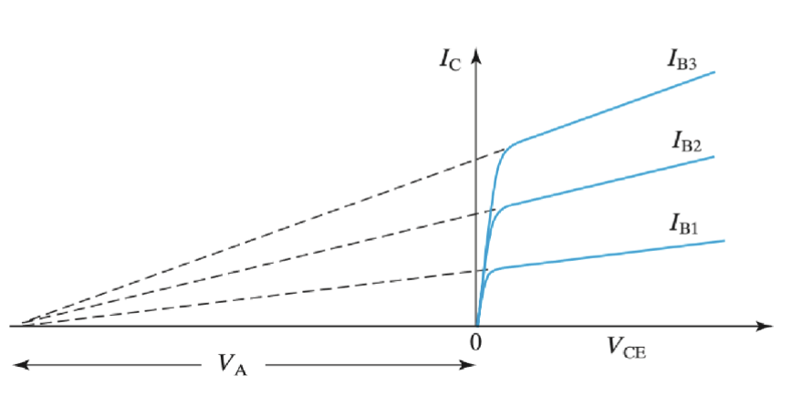

可以发现，在饱和区，其曲线可以近似看作一条直线，然后每条直线的反向延长线都与横坐标轴相交于一个点 $V_A$。这代表当 BJT 工作在饱和区时，集电极电流 $I_C$ 并不是完全不受 $V_{CE}$ 影响的，而是随着 $V_{CE}$ 的增加而略微增加。这种现象称为基极宽度调制 (Base Width Modulation)，也被称为 “早期效应” (Early Effect)。这会给其引入一个输出阻抗。

$$
r_0 = (\frac{\partial I_C}{\partial V_{CE}})^{-1} = \frac{V_A}{I_C}
$$

在较大的电压增益的情况下，更大的 $V_A$ 会带来更大的输出阻抗，从而提升整体增益，表现更好。

其具体的产生原因是，在集电极电压 $V_{CE}$ 增加时，集电结的反向偏置增大，导致集电结耗尽区宽度增加，从而使得基区有效宽度减小。基区宽度减小会导致更多的电子从发射极注入到集电极，从而增加了集电极电流 $I_C$。

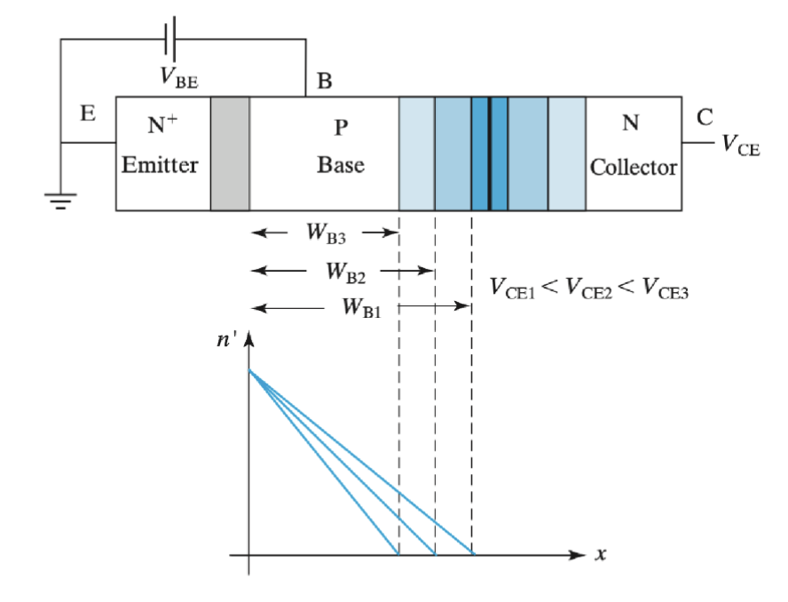

解决的方法有

- 增加基极宽度
- 增加基极掺杂浓度 $N_B$
- 减小集电极掺杂浓度 $N_C$
