# 结型场效应晶体管 (JFET)

## JFET 概述

场效应管 (Field-Effect Transistor) 指的是通过电场效应来控制电流流动的电子器件。 JFET (Junction Field-Effect Transistor) 是最早被发明的场效应管类型之一。它由一个半导体通道和两个 PN 结组成，通过控制 PN 结的偏置来调节通道的电导，从而控制电流的流动。

FET 的分类如下图：

JFET 是一个三端口的压控半导体设备，可以用于控制开关或者放大器，电路符号和结构如图所示：

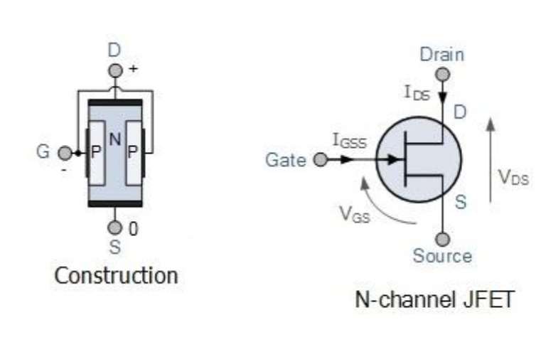

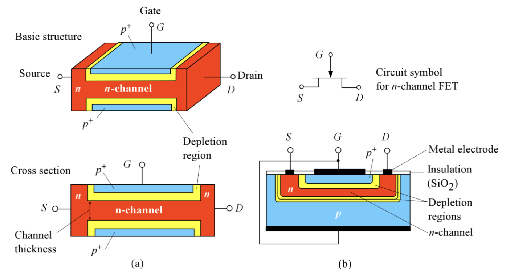

和 BJT 类似，JFET 的结构里有三个端口，两个 PN 结。对于常见的 n 沟道 JFET (n-channel JFET)，其通道由 n 型半导体材料构成，两个 PN 结由 p 型材料形成。对于 p 沟道 JFET (p-channel JFET)，则相反。

## JFET 工作原理

### 栅极不施加电压

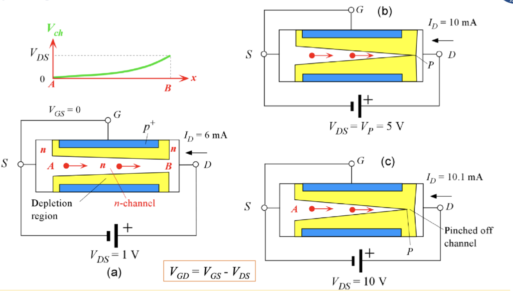

把源级设为参考电压，则在沟道内的不同位置，其内部点位的变化曲线如左上角的图所示。此时我们不在栅极上施加电压，在漏极上施加的电压越大，则两侧的耗尽层会越宽，沟道的有效宽度会变窄，从而限制了漏极电流 $I_D$ 的增大。

当漏极电压 $V_{DS}$ 增大到某个值 $V_P$ 时，两侧的耗尽层会完全闭合，沟道被“夹断”，此时漏极电流达到最大值 $I_{DSS}$，之后无论如何增大 $V_{DS}$，漏极电流都不会再明显增加，这个现象称为“钳位” (pinch-off)。

基于这个现象，我们定义在栅极电压为 0 的情况下的钳位电压：

$$
V_{GD(\mathrm{pinch-off})} = -V_P
$$

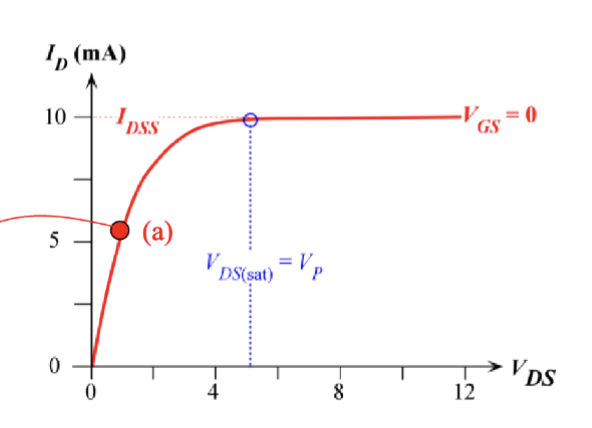

钳位的现象发生主要是因为大于 $V_P$ 的那一部分电压基本都被增加的耗尽层所消耗掉了，导致实际加在沟道上的电压没有继续增加，因此漏极电流也不会继续增加。

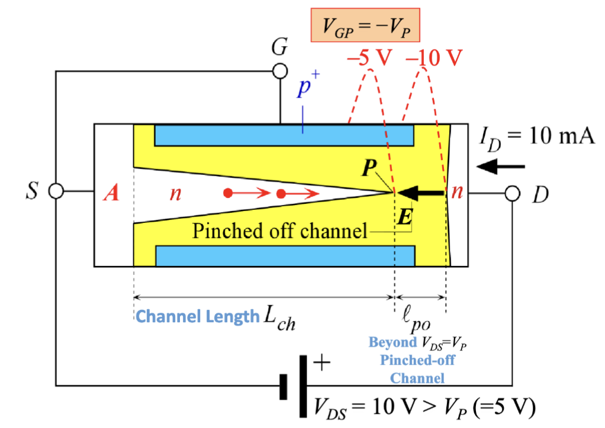

这个时候，N 沟道中的电子向 P 区漂移，到达 P 区时会被电场扫过夹断的沟道。这个过程类似于 BJT 的基区中的少数载流子行为。

此时的漏极电流实际上主要由 A 到 P 之间的导电 n 沟道的电阻 $R_{AP}$ 来决定，也就是

$$
I_D = \frac{V_P}{R_{AP}}
$$

而 P 之后的区域因为载流子耗尽有很高的电阻吸收了大部分电压。

### 栅极施加少量电压

还是以源级作为参考电压，给栅极施加一个负的电压大小 $V_{GS}$。此时，耗尽区的宽度会变宽，从而进一步减小了沟道的有效宽度。在这种情况下，只用施加更小的漏极电压 $V_{DS}$ 就可以使沟道夹断，并且最终得到了更小的漏极电流 $I_D$。

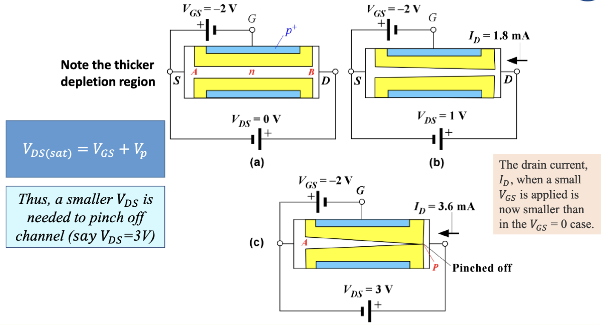

定量来说，几个电压之间的关系是

$$
V_{DS\mathrm{(sat)}} = V_{GS} + V_P
$$

所以，图中在栅极施加的电压大小为 $-2V$，因此在漏极施加了 $3V$ 时沟道就被夹断了。

通过更改在栅极上施加不同大小的电压大小，我们可以控制漏极电流 $I_D$ 的大小，最终如图所示

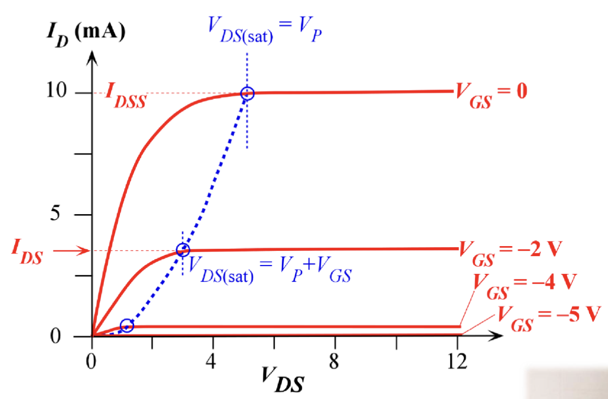

PPT 上给的类比例子是一个水龙头，漏极电压提供的是水源，然后栅极电压就像是水龙头的开关，通过调节水龙头的开合程度来控制水流的大小。

---

在施加了栅极电压后，沟道内部的电位分布有一点差异，如下图所示：

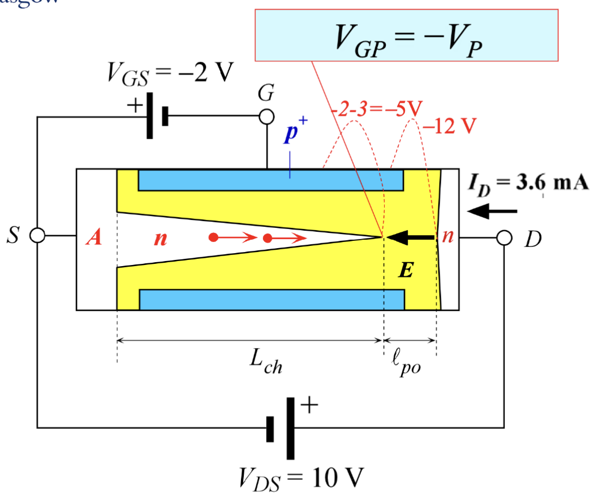

这次我们还是把沟道最终被夹断的点叫 P 点，此时 P 点的电位大小并不是之前的 $V_P$，而是 $V_P + V_{GS}$。因此，漏极电流可以表示为：

$$
I_D \approx I_{DS} \approx
\frac{V_{DS\mathrm{(sat)}}}{R_{AP}(V_{GS})} =
\frac{V_P + V_{GS}}{R_{AP}(V_{GS})}
$$

这里 $V_{GS}$ 是施加的栅极电压， $R_{AP}(V_{GS})$ 是 N 沟道的 A 到 P 点的有效电阻，这里的括号的意思是这个电阻会随着栅极电压的变化而变化，是一个函数。

随着栅极电压在负向增大，增加了 PN 结的反向偏置，沟道宽度会更窄，进而电阻会变得更大；同时，$V_{DS\mathrm{(sat)}}$ 也会变小。因此，漏极电流 $I_D$ 会随着栅极电压的负向增大而减小。这两种效应同时作用，使得漏极电流 $I_{DS}$ 几乎随着 $-V_{GS}$ 的增大而抛物线式减小 (parabolically decreasing)。

### 栅极施加关断电压

$$
V_{DS\mathrm{(sat)}} = V_{GS} + V_P
$$

如果我们在 $V_{GS}$ 上施加一个足够大的电压，比如 $V_{GS} = -V_P$，此时不在漏极上施加电压，则两个耗尽层在整个沟道长度上都相互接触，整个沟道都被关闭了。

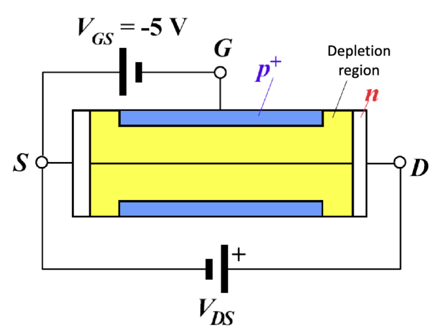

当我们施加 $V_{DS}$ 时，流过的电流只由耗尽层中的热生载流子产生，非常的小。根据下图也可以看出，在 $V_{GS} \leq -V_P$ 时，漏极电流 $I_D$ 几乎为零。

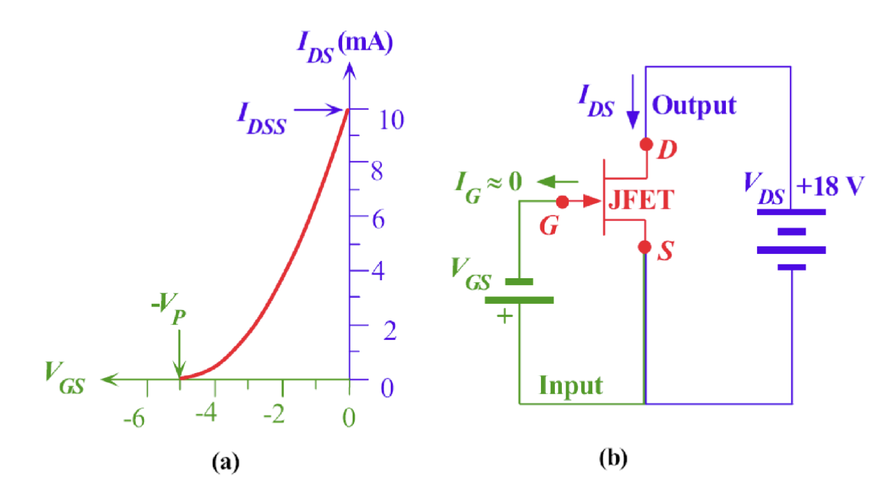

图中的 $I_{DS}$ 的一个简单计算公式为

$$
I_{DS} = I_{DSS} [1-\frac{V_{GS}}{V_{GS}(off)}]^2
$$

这里的 $I_{DSS}$ 是在 $V_{GS} = 0$ 时的漏极电流， $V_{GS}(off)$ 是使得漏极电流接近于零的栅极电压，也就是 $-V_P$ 。

## JFET 共源放大器

> 我有模电 PTSD .jpg

JFET 中的晶体管作用是通过 $V_{GS}$ 来控制 $I_D$ 的大小，因此我们可以通过调节 $V_{GS}$ 来实现放大器的功能。在这种放大器中，输入信号是包含 $V_{GS}$ 的栅源电路，输出电路是漏源电路，由漏极电流 $I_D$ 驱动。这种构型因为源极作为输入和输出的公共端口，所以称为共源放大器 (Common-Source Amplifier)。

JFET 不常用 PN 结的正向偏置，输入基本都是负电压，所以输出的最大电流只有 $I_{DSS}$ 。常见的构型如下图所示：

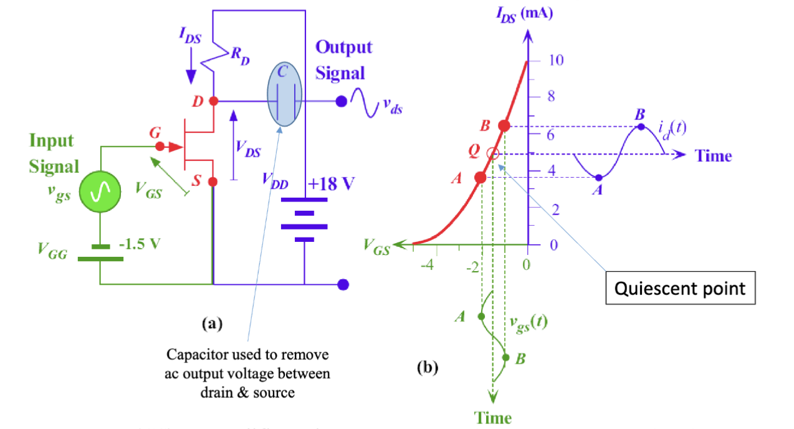

又到了我最喜欢的小信号模型环节。输入信号接在了栅极上，有一个 $V_{GG} = -1.5V$ 的偏置电压，漏极上有一个 $V_{DD} = 18V$ 的电源。漏极串联了一个电阻 $R_D$，最终输出的电压是 $V_D = V_{DD} - I_D \times R_D$，通过一个电容过滤直流分量。

我们之前有得出过这个公式。

$$
I_{DS} = I_{DSS} [1-\frac{V_{GS}}{V_{GS}(off)}]^2
$$

在小信号模型下，对静态工作点附近进行线性化处理，可以得到漏极电流增量和栅源电压增量之间的关系：

$$
\begin{aligned}
  i_d(t) & = g_m v_{gs}(t)  \\
  g_m & = \frac{d I_{DS}}{d V_{GS}} = -\frac{2 I_{DSS}}{V_{GS}(off)} [1-\frac{V_{GS}}{V_{GS}(off)}] \\
  & = -\frac{2 \sqrt{I_{DSS} I_{DS}}}{V_{GS(off)}}
\end{aligned}
$$

但是，这个情况中输入信号的幅度大小为 $v_{gs} = 0.5V$，还是很大，不能忽视非线性成分。在实际的仿真中还是可以发现上下幅度不一致，这是因为线性近似只在小范围内有效，幅度过大时会引入非线性失真。

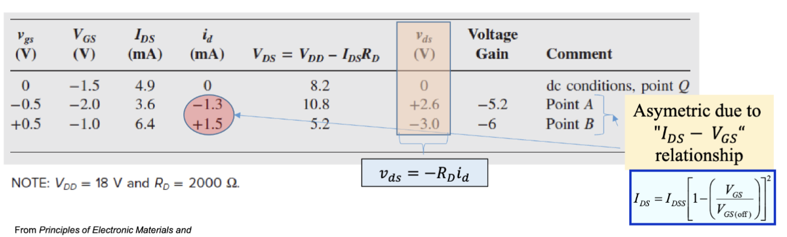

最终，对于这个放大器，仿真的电压增益为

$$
A_{vpp} = \frac{v_{ds(\mathrm{pk-pk})}}{v_{gs(\mathrm{pk-pk})}} = \frac{-3 - 2.6}{ 0.5 - (-0.5)} = -5.6
$$

负数增益意味着输出信号和输入信号是反相的。

---

增大电阻大小 $R_D$ 可以增大电压增益，但是始终需要保证 $V_{DS}$ 不低于 $V_{DS(sat)}$，否则晶体管会进入饱和区，失去放大作用。

当信号相对于直流值较小时，可以用微分表示小信号。在这种情况下， $\Delta V$ 引起的 $\Delta I$ 可以表示变化可以用于定义 JFET 的互导 $g$，也就是我们之前提到的小信号模型中的 $g_m$ 。

$$
g_m = \frac{d I_{DS}}{d V_{GS}} \approx
\frac{\Delta I_{DS}}{\Delta V_{GS}} =
\frac{i_d}{v_{gs}}
$$

还有我们之前推导的

$$
g_m  = -\frac{2 \sqrt{I_{DSS} I_{DS}}}{V_{GS(off)}}
$$

类似的，定义小信号模型中的电压增益

$$
A_V = \frac{v_{ds}}{v_{gs}} = \frac{-R_D i_d}{v_{gs}} =
\frac{-R_D (g_m v_{gs})}{v_{gs}} = -g_m R_D
$$

结论也符合我们之前的分析：增大漏极电阻 $R_D$ 可以增大电压增益 $A_V$ 。

---

> 练习题略
