# 金属氧化物场效应管 (MOSFET)

> 原来人们所说的遇见宿敌的感觉就是这个感觉，模电还是伤我太深了
>
> 你是……不能忘记的人

## MOSFET 概述

和[之前的 JFET 部分](./lec3.2.md#jfet-概述)类似，MOSFET 是另一种 FET 的实现方式，其使用的是金属-氧化物-半导体结构来控制电流的流动。MOSFET 广泛应用于数字电路和模拟电路中，因其高输入阻抗和低功耗特性而受到青睐。MOSFET 还有别的简写，比如

- MOST (Metal-Oxide-Semiconductor Transistor, 金属-氧化物-半导体晶体管)
- IGFET (Insulated-Gate Field-Effect Transistor, 绝缘栅场效应晶体管)
- MISFET (Metal-Insulator-Semiconductor Field-Effect Transistor, 金属-绝缘体-半导体场效应晶体管)
- ...

现代的集成电路通常有几十亿个晶体管，而其中绝大多数都是 MOSFET。

MOSFET 可以分为 N 沟道 (n-channel) 和 P 沟道 (p-channel) 两种类型，分别对应电子和空穴作为主要载流子。其电路符号如下所示：

| 沟道类型      | 载流子 | 源极和漏极掺杂 | 衬底掺杂 |
| ------------- | ------ | -------------- | -------- |
| N 沟道 MOSFET | 电子   | N 型           | P 型     |
| P 沟道 MOSFET | 空穴   | P 型           | N 型     |

其中，又可以以默认状态分为两种类型：

- 增强型 MOSFET (Enhancement MOSFET)：默认状态下沟道不存在，需要通过在栅极施加电压来形成导电通道。
- 耗尽型 MOSFET (Depletion MOSFET)：默认状态下沟道存在，可以导通电流，通过在栅极施加电压来调节沟道的导电性。

组合一下这两种分类，我们可以得到四种不同类型的 MOSFET：

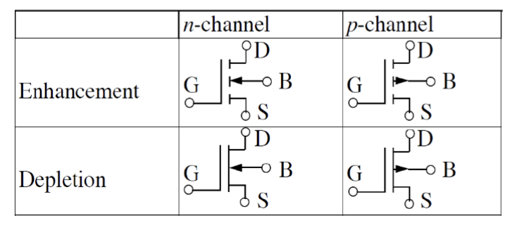

## MOSFET 工作原理

两个由绝缘体隔开的金属板可以看作一个电容，在这金属板上面施加电压会让金属板上积攒电荷，并在两块金属板之间产生电场。金属-空气-金属这种电容器中，电荷都位于金属表面，电厂不会穿透金属内部，这是因为金属内部有大量自由电子，这些电子会重新分布以抵消电场。

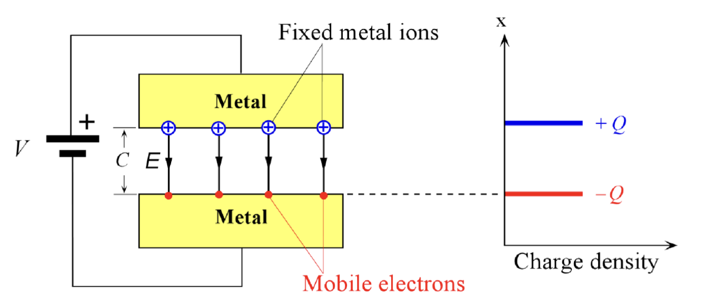

在最终状态，两块金属板之间的电势差等于施加在两块金属板上的电压。如果我们把电势较低的那块金属板换成 p 型半导体，那么电场就会穿透半导体表面的一定深度，这个深度取决于施加的电压大小以及半导体的掺杂浓度。因为表面的负电荷受体数量不足以产生足够的负电荷到 $-Q$。因此，一定量的内部的负受体被暴露出来。

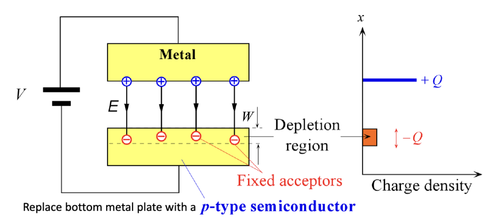

在这个过程中，在金属上施加的正点压会让带正电的空穴远离表面，形成一个耗尽层，进而暴露出一个没有载流子的区域。这个区域中主要含有固定的带负电的受主离子。因此，电场穿透的区域相当于耗尽了其平衡浓度的空穴。

耗尽层的宽度可以通过这个公式计算

$$
Q = q A W N_a
$$

其中，$Q$ 是金属板上积攒的电荷量，$A$ 是金属板的面积，$W$ 是耗尽层的宽度，$N_a$ 是 p 型半导体中受主杂质的浓度。

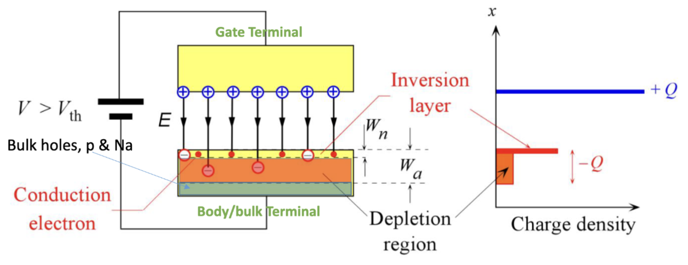

当电压足够高时，半导体和绝缘体之间的界面会出现一个高浓度的负电荷载流子反型层 (Inversion Layer). 这个反型层的形成是因为在高电场下，半导体内部的热激发电子会被吸引到界面处，形成一个富含电子的区域，这个区域的电子浓度甚至可以超过空穴浓度，从而实现了载流子的反转。

一般把反型层中的电子密度和衬底中的空穴密度相等时，外加的电压称为阈值电压 (Threshold Voltage) $V_{th}$。当有外加电压 $V > V_{th}$ 时，反型层就会形成。

这对应的就是 MOSFET 的导通原理，上面的金属板连接的就是 MOSFET 的栅极 (Gate)。其还有两个电极，分别是源极 (Source) 和漏极 (Drain)，分别连接到独立的高掺杂区域。这两个极的掺杂方式相同，和衬底的掺杂方式相反。

下图就是一个典型的 MOSFET 结构图。这是一个 NPN 型的 MOSFET，源极和漏极都是 N 型掺杂，而衬底是 P 型掺杂。我们称这个叫做 NMOS。

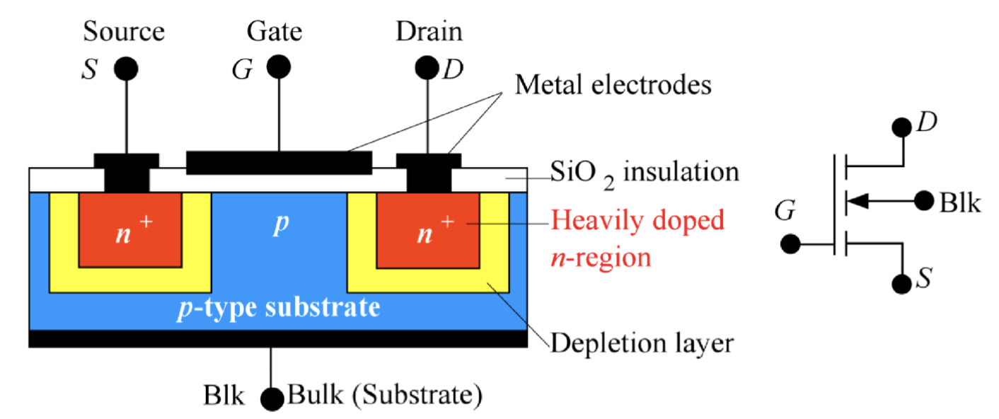

这里的源极和漏极的掺杂标注的是 "n+"，表示其掺杂浓度非常高，远高于衬底的掺杂浓度。这样做的目的是为了确保源极和漏极区域有足够的载流子，以便在 MOSFET 导通时能够提供足够的电流。对应的，如果是 PMOS，则分别是 "p+" 和 "n"。

> 源极叫做源极，是因为它是载流子的源头，在这里载流子是电子；漏极叫做漏极，是因为载流子从这里流出。所以，在 NMOS 中，源极连接到较低电位（通常是地），而漏极连接到较高电位。

## MOSFET 的伏安特性

### 增强型 MOSFET (Enhancement MOSFET)

之前我们演示的就是一个典型的增强型 MOSFET。他叫增强型，因为给栅极施加的电流可以增强源极和漏极之间的导电能力。

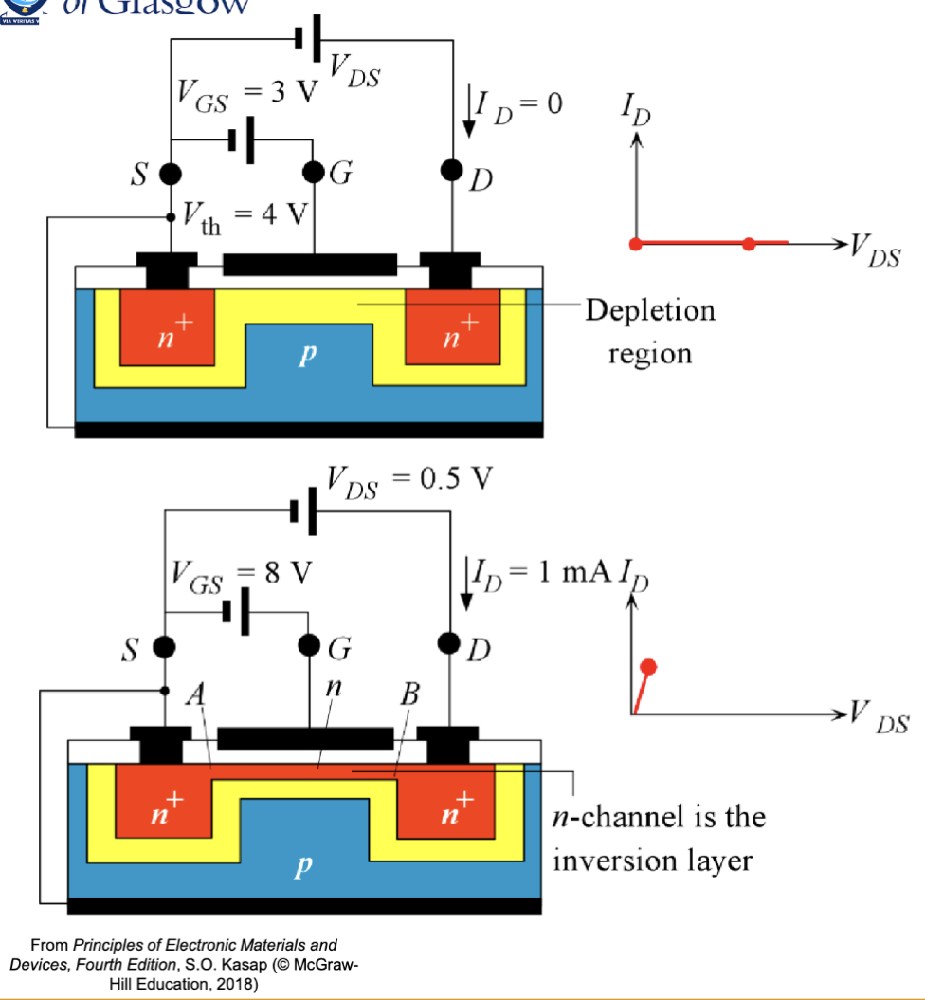

其在栅极施加的电压大小 $V_{GS}$ 小于阈值电压 $V_{tH}$ 时，两个 "n+" 掺杂的源极好漏极之间还是被耗尽区间隔，可以看作一个开路状态，没有电流流过。当施加足够大的正电压 $V_{GS} > V_{tH}$ 时，反型层形成，源极和漏极之间形成一条导电通路，电流可以流过。在漏极电压 $V_{DS}$ 比较小时，漏极的电流大小就是

$$
I_D = \frac{V_{DS}}{R_n}
$$

在这一区域内，可以认为漏极电流随着漏极电压的增大而线性增大，这个区域叫做线性区 (Linear Region)。

---

在 $V_{DS}$ 变大的过程中，B 点点电压 $V_{GD}$ 逐渐减小，在漏极附近的反型层灰逐渐变窄，沟道电阻 $R_{th}$ 逐渐增大。最后，当 $V_{GD}$ 减小到阈值电压 $V_{th}$ 时，沟道在漏极附近被夹断。此时， $V_{DS}$ 达到了饱和值 $V_{DS\mathrm{(sat)}}$，$V_{GD} = V_{GS} - V_{DS\mathrm{(sat)}} = V_{th}$。

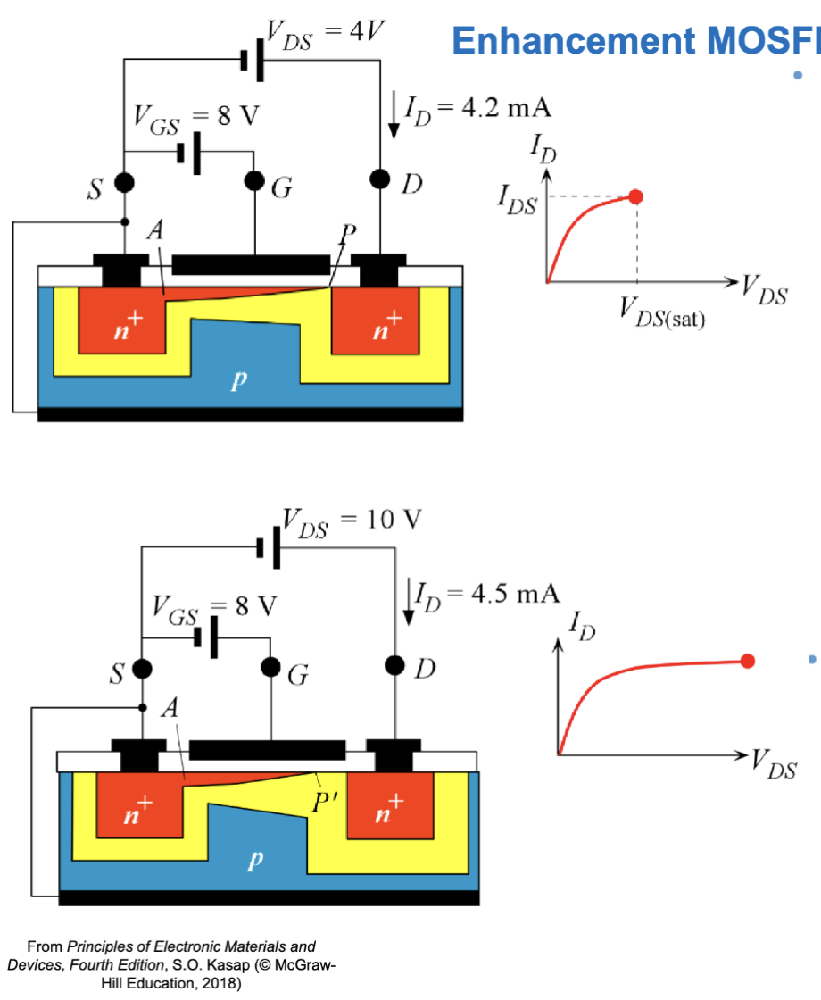

当 $V_{DS}$ 继续增大时，增加的电压大小被 P' 之后当耗尽层吸收，漏极电流 $I_D$ 不再增大，进入饱和区 (Saturation Region)。在这个区域内，漏极电流近似为常数，可以表示为

$$
I_D \approx I_{DS} = \frac{V_{DS\mathrm{(sat)}}}{R_{AP'\mathrm{(n-ch)}}}
$$

---

把两个区域综合起来，NMOS 的漏极电流的图像如下所示：

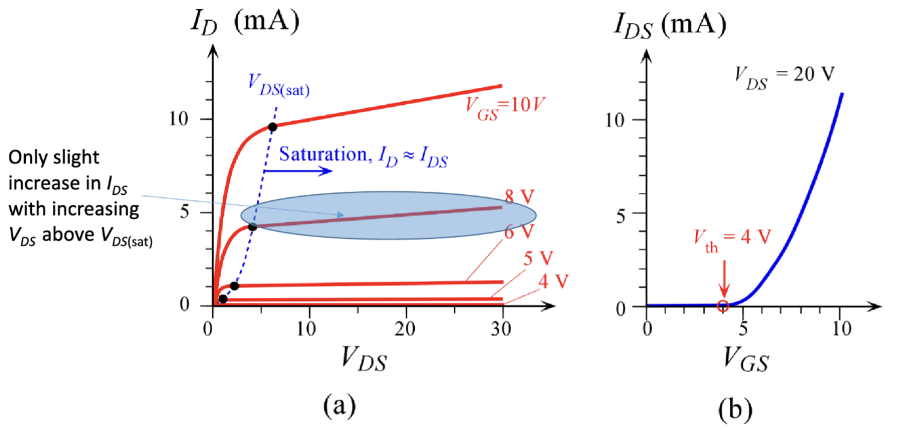

之后，线性区的漏极电流可以表示为

$$
\begin{aligned}
  I_{DS} & = K \left[ 2(V_{GS} - V_{th})V_{DS} - V_{DS}^2\right]\\
  K &= \frac{Z \mu_e \varepsilon}{2 L t_{ox}}
\end{aligned}
$$

其中，$\mu_e$ 是电子的迁移率，$t_{ox}$ 是氧化层的厚度，$Z$ 是沟道的宽度，$L$ 是沟道的长度，$\varepsilon$ 是氧化层的介电常数。最终算出来的 $K$ 成为工艺参数 (Process Parameter)，它和具体的制造工艺有关。

而饱和区的漏极电流可以表示为

$$
I_{DS} = K (V_{GS} - V_{th})^2 (1+ \lambda V_{DS})
$$

[和 JFET 类似](./lec3.2.md#栅极施加少量电压)，这里的 $\lambda$ 是沟道长度调制参数 (Channel Length Modulation Parameter)，表示沟道长度变化对漏极电流的影响，典型大小为 $0.01 V^{-1}$。其与横轴相交于 $-\frac{1}{\lambda}$ 处。

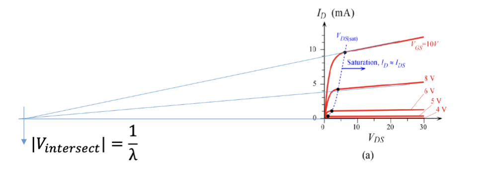

所以，对于共源放大器的小信号模型的情况，其跨导参数可以表示为

$$
g_m = \frac{\partial I_D}{\partial V_{GS}} = \frac{2 I_D}{V_{GS} - V_{th}} = \frac{2 I_D}{V_{ov}}
$$

这里的 $V_{ov} = V_{GS} - V_{th}$ 称为过压 (Overdrive Voltage)，表示栅极电压超过阈值电压的部分。之后，电压增益大小为:

$$
A_V = -g_m R_D
$$

### 耗尽型 MOSFET (Depletion MOSFET)

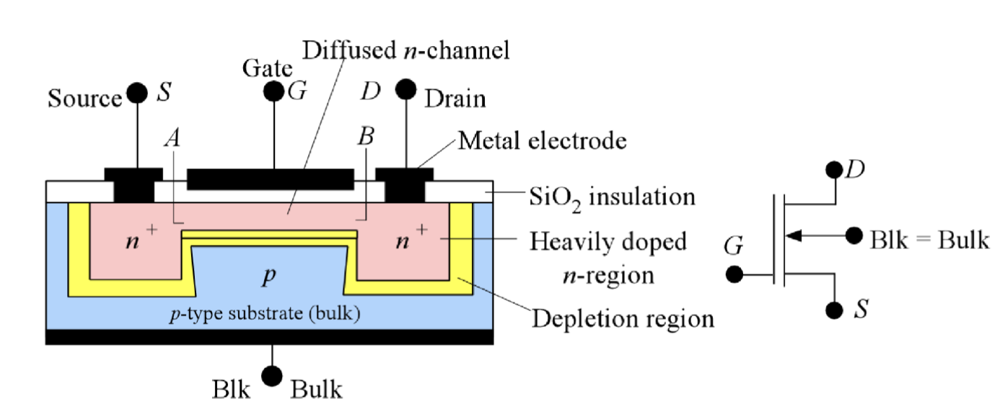

耗尽型 MOSFET 和增强型 MOSFET 不同，其是一个常开的设备，而增强型是常关的。耗尽型 MOSFET 的电路符号右侧是一条连续的线而不是三条断开的线。在掺杂结构上，耗尽型 MOSFET 的沟道区域本身就是掺杂好的导电通道，而不是通过栅极电压来形成的反型层，和 JFET 类似。

当不在栅极上施加电压时，耗尽型 MOSFET 的沟道已经存在，源极和漏极之间可以导通电流。其电流 $I_D$ 和漏极电压 $V_{DS}$ 的关系如下图所示，先上升，在 $V_{DS}$ 达到饱和值 $V_{DS\mathrm{(sat)}}$ 后沟道被夹断，进入饱和区，饱和电流为 $I_{DSS}$。

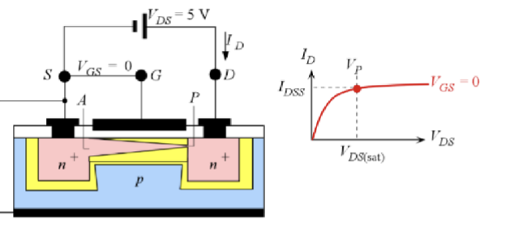

以源极为参考电压，给栅极施加负电压，则沟道出现一部分耗尽区，宽度变窄，电阻升高。$V_{DS}$ 饱和得更快，饱和电流减小。如图所示：

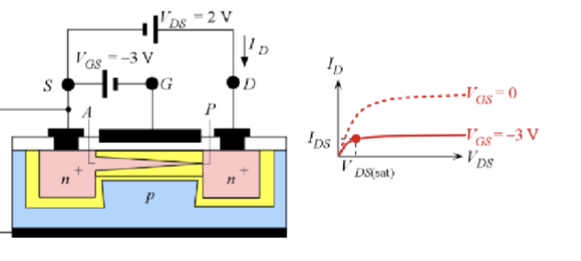

当给栅极施加正电压时，正点压的效果可以抵消一部分漏极电压带来的夹断，进而延迟饱和的到来，饱和电流增大。如图所示：

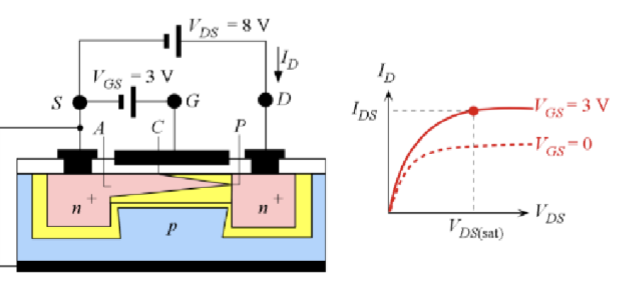

## 互补 MOSFET (CMOS)

基于 MOSFET 的伏安特性，MOSFET 的一个典型应用场景时作为开关使用。逻辑电路中，高电平为逻辑 1，低电平为逻辑 0。当栅极电压为高电平时，MOSFET 导通，源极和漏极之间形成导电通路，相当于闭合开关；当栅极电压为低电平时，MOSFET 截止，源极和漏极之间没有导电通路，相当于断开开关。比如这个构型

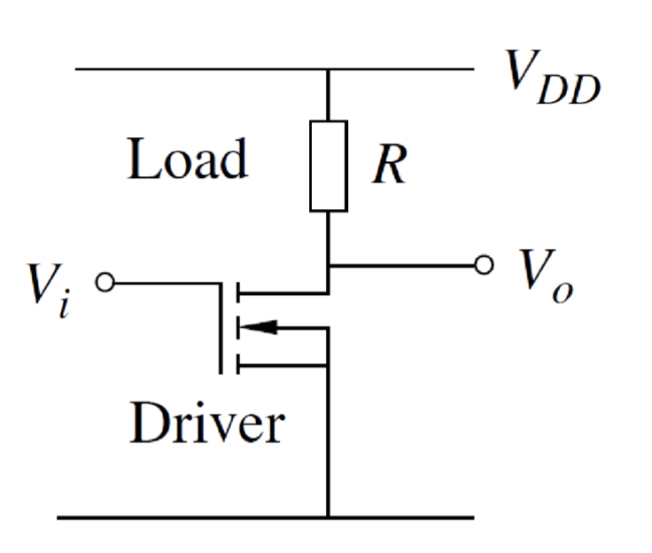

其中，R 的典型值大小为 $1M\Ohm$。 当输出低电平的时候，驱动器开启，直流电流较大，这会导致显著的功耗。目前的数字电路设计中，通常使用互补 MOSFET (Complementary MOSFET, CMOS) 技术来实现低功耗的逻辑门电路。CMOS 技术结合了 NMOS 和 PMOS 晶体管的优点，通过互补的工作方式来减少静态功耗。

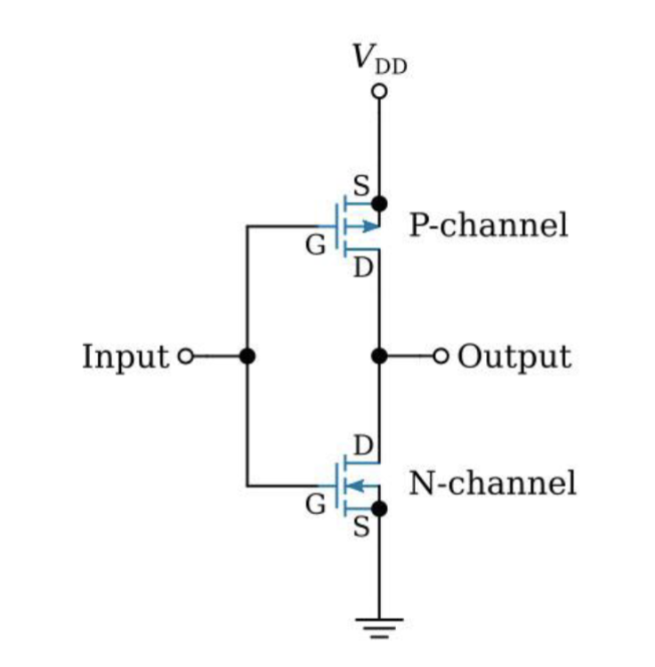

CMOS 就是把一个 PMOS 和一个 NMOS 组合在一起使用。当输入为高电平时，NMOS 导通，PMOS 截止，输出被拉到低电平；当输入为低电平时，PMOS 导通，NMOS 截止，输出被拉到高电平。这样，在稳态下几乎没有直流电流流过，从而实现了低功耗的逻辑操作。

这两个 MOSFET 可以被直接制造在一个芯片上来实现高密度集成电路：

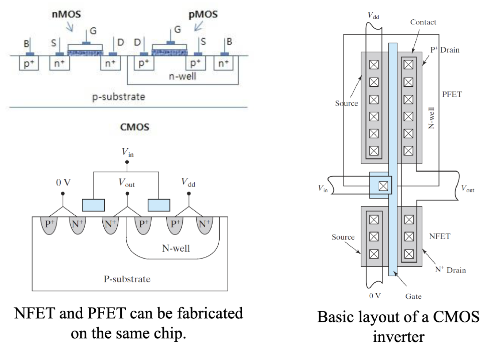

类似的，CMOS 还可以实现更多的逻辑电路功能，如

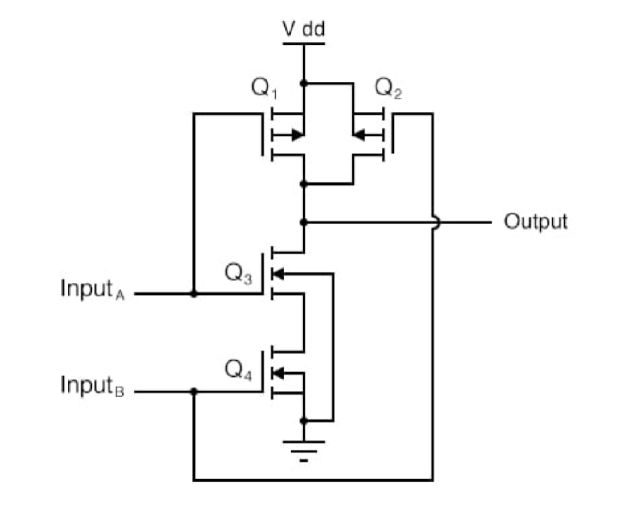

这个是一个是一个 CMOS 与非门 (NAND Gate) 的电路图。当输入 A 和 B 都为高电平时，NMOS 导通，PMOS 截止，输出被拉到低电平；在其他情况下，PMOS 导通，NMOS 截止，输出被拉到高电平。

然后，因为 NAND 是一个最小完全集，所以可以通过组合 NAND 门来实现任意逻辑函数。这使得 CMOS 技术成为现代数字电路设计的基础，广泛应用于微处理器、存储器和各种数字系统中。
