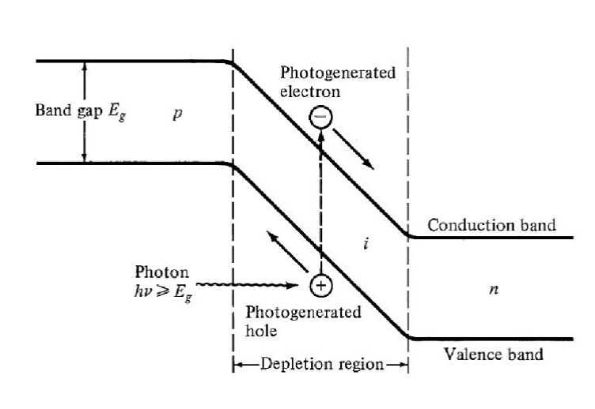
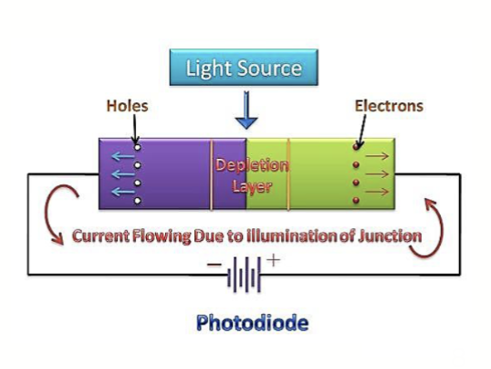
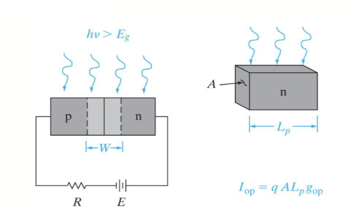
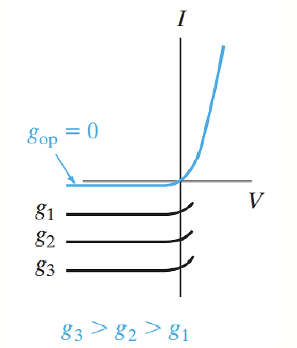
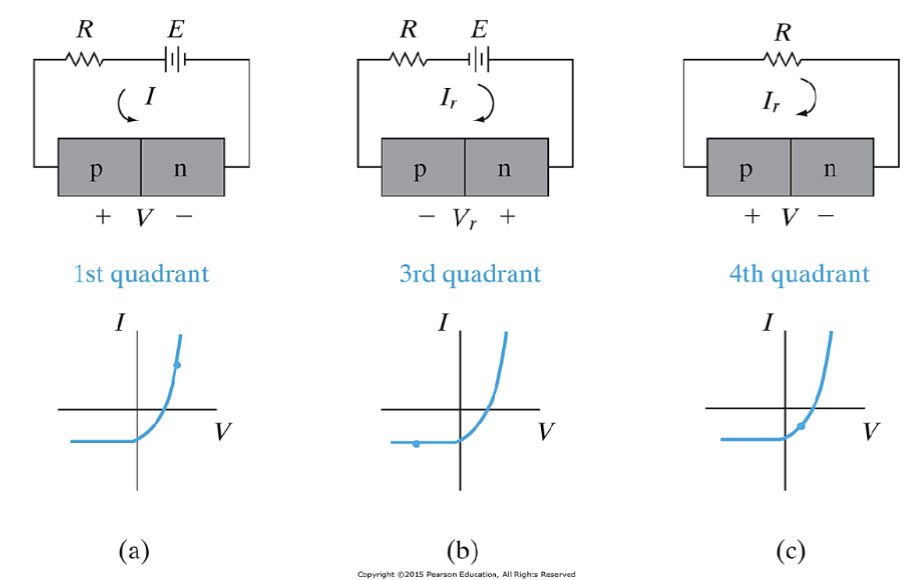
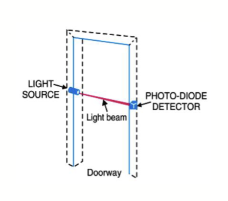
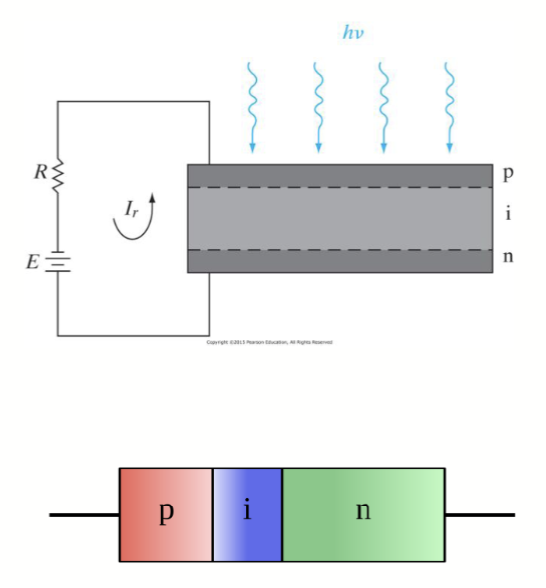
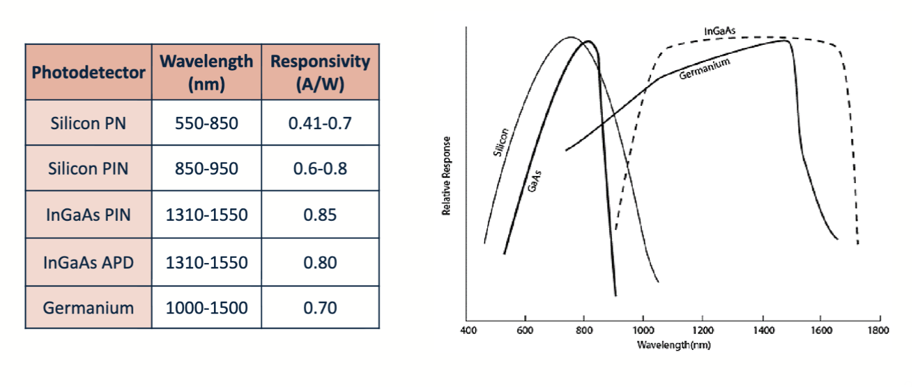
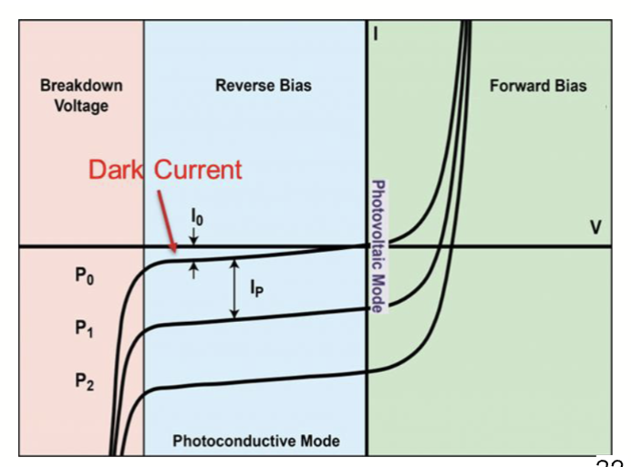

# 光电二极管 (Photodiodes)

## 背景知识

光电子 (Optoelectronic) 指的是半导体有和光子相互作用的功能。对应的，光电子器件 (Optoelectronic Devices) 则是可以检测或者发射光子的器件。

光电导体 (Photoconductors) 指的是表现出光电特性的器件或者材料，这种材料在光照下电导率发生变化。

光电子器件有非常多的种类，包括将光能转换成电能的器件以及光子的发射器。对于前者，典型的有光电二极管 (Photodiodes) 和太阳能电池 (Solar Cells)；对于后者，典型的有发光二极管 (LEDs) 和激光形式存在的相干光源，也就是激光 (Lasers)。

## 光电二极管原理

### 产生电子-空穴对

光电二极管是一种设计用来响应光子吸收的二端口半导体器件。有些光电二极管有着极高的灵敏度和响应速度，由于现代的电子学通常同时涉及光信号和电信号，光电二极管作为光电转换器件在很多应用中都非常重要，比如光纤通信系统、光学传感器、光学测量仪器等。

长这个样子：

在没有外加偏置电压的情况下，二极管内部的能带图是这样的：

因为 P 型半导体和 N 型半导体中的能级差异，光电二极管有内建电势。

当来自入射光的光子击中光电二极管，他们可能会被吸收。如果光子的能量大于半导体材料的带隙能量，半导体中就会被激发出一个电子-空穴对。电子会移动到 N 型区域，而空穴会移动到 P 型区域。这种载流子的分离是由于内建电场的作用。

如果给光电二极管施加反向的外部电压作为偏置，二极管中的耗尽区的宽度会增加，从而增强了内建电场的强度。这种增强的电场有助于更有效地分离和收集由光子产生的电子-空穴对，减少了载流子的复合几率，提高了光电二极管的响应速度和灵敏度。

光子激发产生的电子和空穴产生的电流被称为光电流 (Photocurrent)。光电流的大小与入射光的强度成正比，因此光电二极管可以用来测量光强。

$$
I_{op} = q A g_{op}(L_p + L_n + W)
$$

其中，$q$ 是电子的电荷量，$A$ 是二极管的横截面积，$g_{op}$ 是光生载流子产生率，$L_p$ 和 $L_n$ 分别是 P 型和 N 型区域的少数载流子扩散长度，$W$ 是耗尽区的宽度。

### 光电二极管的 I-V 特性

如果把热生电流计算为 $I_{th}$，那么光电二极管的总电流可以表示为

$$
I = I_{th}(e^{qV/kT} - 1) - I_{op}
$$

其中，$V$ 是外加电压，$k$ 是玻尔兹曼常数，$T$ 是绝对温度。最后得到的值实际上是常规二极管方程描述的电流减去光电流。也就是说，在偏置恒定的情况下，不同的光照相当于把二极管的 I-V 曲线整体向下平移。

当二极管两端偏置大小为 0 时，器件短路，整个器件中只剩下的光电流。此时

$$
I = - I_{op}
$$

当二极管两端开路时，通过器件的总电流大小为 0，带入原式子可得

$$
V_{oc} = \frac{kT}{q} \ln\left(\frac{I_{op}}{I_{th}} + 1\right)
$$

其中，$V_{oc}$ 称为开路电压 (Open-Circuit Voltage)。

### 光电二极管的工作状态

从我们之前的描述，不难看出，光电二极管一般工作在反向偏置状态下，基本是 I-V 曲线的第三第四象限部分。

在第三象限 （以及正向导通）的部分，主要是外部电路向光电二极管内部输送功率；在第四象限部分，光电二极管将吸收的光能转换为电能，向外部电路输送功率。

当光电二极管在被施加反向偏置，在第三象限工作时，电流大小因为二极管特性，与电压大小基本无关，而主要取决于入射光的强度。在这个状态下，光电二极管就相当于一个光控电流源。

在大部分光探测应用中，探测器的响应速度是至关重要的，对应的就是二极管中可以响应光照的部分：耗尽层宽度 $W$。耗尽层宽度增大，响应速度也会增大，但是同时光子在半导体中的吸收率会降低，从而降低光电流的大小。因此，在设计光电二极管时需要在响应速度和灵敏度之间进行权衡。

控制耗尽层宽度的一种编写方法是使用 p-i-n 结构 (p-i-n Structure)。这种结构在 P 型和 N 型半导体之间插入一个本征半导体 (Intrinsic Semiconductor) 层。这样可以显著增加耗尽层的宽度，从而提高响应速度，同时保持较高的光子吸收率。

## 光电二极管的参数

这是原本的 PN 二极管结构，由一个 PN 结组成，在反向偏置下工作。

这是 PIN 结构下的光电二极管，在 P 和 N 类型中加了一个本征半导体层。其有很低的暗电流，也就是在没有光子进入二极管时，流过二极管的电流非常低。同时，其可以在更宽的波长范围内探测光。这让 PIN 结构的光电二极管被用作高速和低噪声的光探测器。

还有一种雪崩光电二极管 (Avalanche Photodiode, APD)，其工作原理是利用高电场下的载流子碰撞电离效应来实现内部增益，从而提高光电流的强度。APD 通常在更高的反向偏置下工作，以产生足够的电场强度来引发雪崩效应。其被用于微光检测，如天文学、光纤通信和激光雷达等系统中。

---

控制光电二极管工作的主要方式时产生的光电流 $I_{op}$，入射光功率 $P$ 和响应度 $R$ 之间的关系。

$$
\mathrm{Responsivity} (R) = \frac{I_{op}}{P}
$$

在不同的波长下，响应度会有所不同。响应度还可以表示为

$$
R(\lambda) = \eta\frac{q}{h f} \approx \eta \frac{\lambda_{\mathrm{(\mu m)}}}{1.23985}
$$

其中，$\eta$ 是量子效率 (Quantum Efficiency)，表示每个入射光子产生的电子-空穴对的数量；$h$ 是普朗克常数，$f$ 是光子的频率，$\lambda_{\mathrm{(\mu m)}}$ 是光子的波长，单位为微米。

常见材质下的光电二极管响应度曲线如下：

---

在反向偏置区中，即使没有入射光，光电二极管中也会有少量电流流过，这个电流被称为暗电流 (Dark Current)。暗电流主要来源于热激发产生的载流子，这些载流子在没有光照的情况下也能在半导体中移动。随着方向偏置的增大，暗电流会略微增大，受材料、温度、有效区域面积等因素影响。

通常硅基器件比锗基器件有更低的暗电流。

## 光电二极管的工作区域

光电二极管一共有两种不同的工作方式，不同的工作模式选择主要取决于应用的速度要求和可容忍的漏电流大小。

在光电导模式 (Photoconductive Mode) 下，光电二极管被施加反向偏置电压。这样可以增加耗尽区的宽度，提高响应速度和线性度。光电导模式适用于需要快速响应和高线性度的应用，如高速光通信和精密光测量。

其通常有较大的暗电流，但是可以通过材料加以限制。

---

对应的，没有外加偏置电压的工作模式被称为光伏模式 (Photovoltaic Mode)。在这种模式下，光电二极管工作在零偏置状态，主要用于太阳能电池等应用。光伏模式下，光电二极管产生的电压和电流直接由入射光决定，适用于低功耗和环境光检测等场景。

这种模式有最小的暗电流，但是响应速度较慢。这个模式同时也是太阳能电池的工作模式。
