# 发光二极管 (LED)

## 发光二极管概述

发光二极管本质上是一个 PN 结，由直接带隙半导体材料 (direct bandgap semiconductor) 制成，比如 GaAs。其中的 EHP 复合会发射光子，从而实现电能到光能的转换。发射出来的光子能量近似等于半导体的带隙能量：

$$
h f \approx E_g
$$

直接带隙指的是导带和价带的能量极值点在动量空间 (momentum space) 上重合，这使得电子从导带到价带的跃迁更容易发生，并且能够高效地发射光子。相比之下，间接带隙半导体（如硅）由于需要声子的参与，导致光发射效率较低，因此不适合用于 LED。如下图

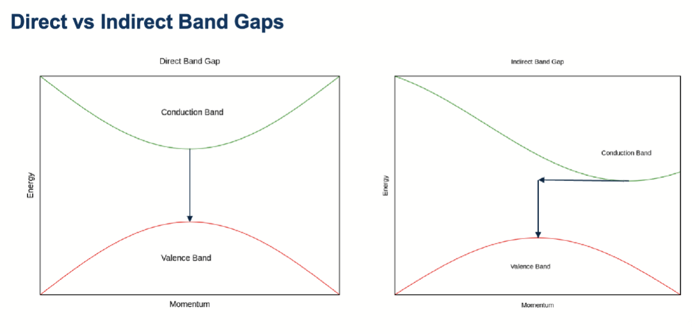

左图的导带和价带的极值点在横坐标上是对齐的，表示直接带隙；右图中导带极值点和价带极值点在横坐标上不对齐，表示间接带隙，电子需要改变一定的动量才能完成跃迁。

---

LED 通常由半导体材料制成，比如 GaAs, GaN, InGaN 等，不同的半导体材料因为有不同的带隙能量，从而发射不同波长的光。通过调节材料的组成，可以实现从红外到紫外的不同颜色的 LED。

LED 被广泛运用，因为其高效性、多种色彩变化、长寿命、开关自由、有方向性、体积紧凑、环保、高可靠性等优点。

常见的 LED 可以分为

- 标准 LED : 在可见光内发光，有多种颜色，用于普通照明和消费电子等
- IR LED : 发射红外光，常用于遥控器、夜视设备和光通信等应用。
- 大功率 LED : 用于高亮度照明且集中照明，如汽车大灯、建筑照明、手电筒、舞台照明、高强度应用场景
- RGB LED : 由红、绿、蓝三种颜色的 LED 组成，可以通过调节三种颜色的亮度来实现多种颜色的显示，常用于显示屏、氛围照明、变色照明、娱乐和装饰等

## LED 的工作原理

传统的 LED 结构有这个几个部分：

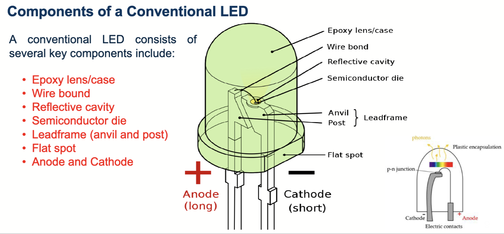

- 环氧树脂 (Epoxy) 的外壳
- 缝合引线
- 反射腔
- 半导体裸片
- 引线框架
- 平面点
- 阴极和阳极

其结构简单来说，是将裸片封装在一个透明的环氧树脂中，环氧树脂起到保护和光学透射的作用。引线框架和缝合引线用于将 LED 连接到外部电路。反射腔用于提高光的提取效率，将更多的光导向外部。

---

LED 中的能带图如下：

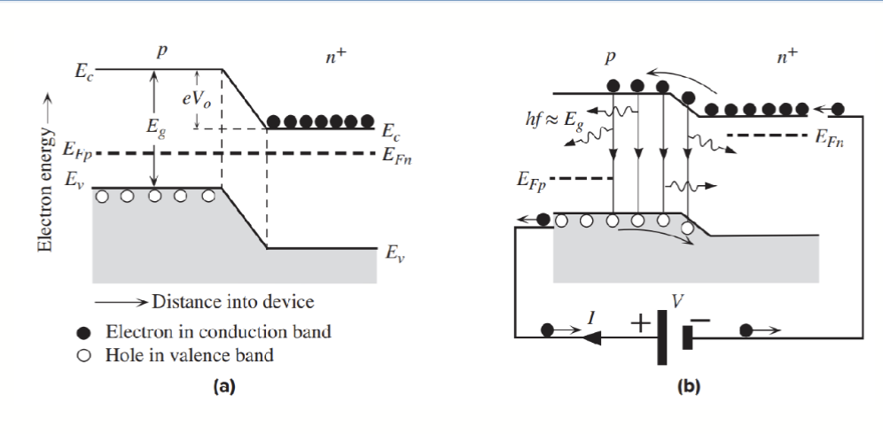

左图是没有外加偏置的情况，n 型半导体是重掺杂的，p 层通常很薄，整个器件的费米能级是统一的，也就是 $E_{F_p} = E_{F_n}$

当是加了一个正向偏置 $V$ 时，PN 结附近以及 P 区的电子扩散长度内的电子直接复合，导致光子发射。左右两侧的费米能级分离，$E_{F_n} - E_{F_p} = eV$。

这种发光过程叫做电致发光 (Electroluminescence, EL)，指的是电流通过材料时，由于空穴和电子的辐射复合 (radiative recombination) 而产生光的现象。对于重掺杂 N 型的 PN 结中，由于少数载流子输入导致 EHP 复合而发光的现象被称为注入型电致发光 (Injection Electroluminescence)。

---

由于电子和空穴之间复合过程的统计性质， LED 发射的光子方向是随机的，他们源于电子和空穴之间的自发辐射复合 (Spontaneous Radiative Recombination)，这种自发复合过程导致了自发光子发射 (Spontaneous Photon Emission)。

LED 发射的光是非相干光 (Incoherent Light)，与激光器发射的相干光不同。

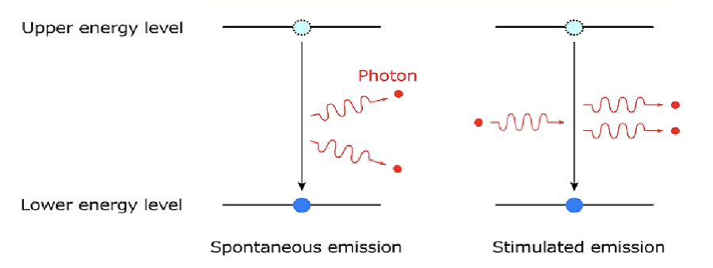

## 不同 LED 的结类型

LED 可以有不同的结类型，主要有以下几种：

- 同质结：有两种不同掺杂方式但是相同材料的 PN 结，比如 GaAs 的 P 型和 N 型区域组成的 LED。
- 异质结：由不同材料组成的 PN 结，比如 GaAs 和 AlGaAs 组成的 LED。异质结可以提供更好的载流子注入效率和光子提取效率。
- 双异质结：在 P 型和 N 型区域之间插入一个不同材料的本征半导体层 (Intrinsic Layer)，形成 P-I-N 结构。这样可以更有效地限制载流子扩散，提高发光效率。

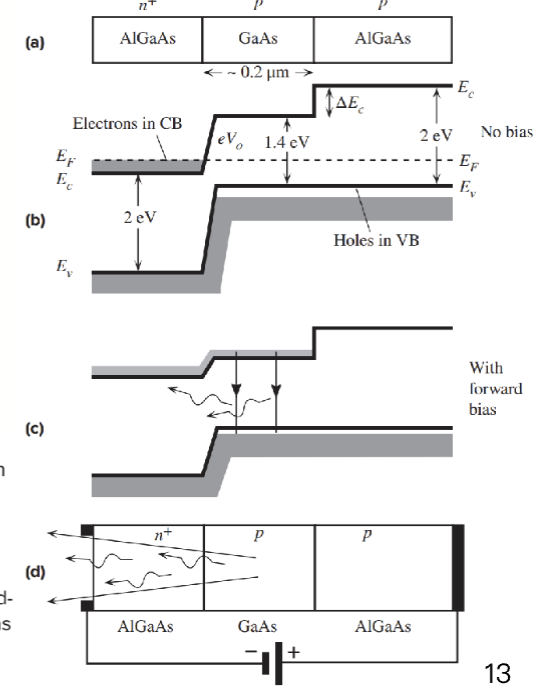

## 量子阱高亮度 LED

常见的量子阱(Quantum Well, QW) 结构如下：

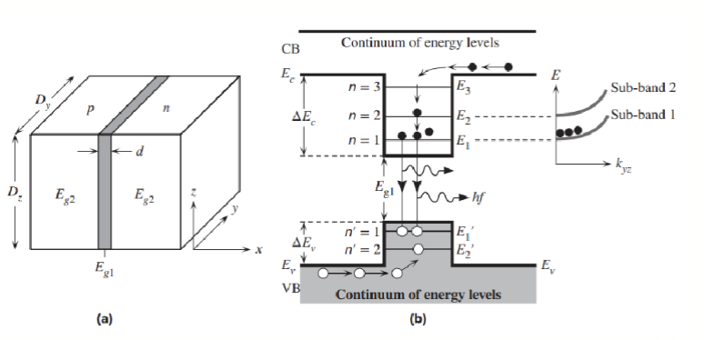

其中间包含一个超薄的窄带隙半导体，带隙大小为 $E_{g1}$，两侧是宽带隙半导体，带隙大小为 $E_{g2}$。这一层被称为限制层 (Confining Layer)，其作用是将电子和空穴限制在量子阱中，从而提高载流子浓度和复合效率。

这两种半导体是晶格匹配的 (Lattice-matched)，这样可以减少界面缺陷，提高器件性能。通过调整量子阱的厚度和成分，工程师可以控制能级 ，进而控制发射光的波长。这对生产特定颜色的 LED 非常重要。

应用场景很广泛，比如显示、固态照明、医学成像、传感器、光通信、军事、娱乐

## LED 的发光材料

由于需要可见光和红外波长的半导体激光器和 LED，可用的 II-V 族的材料种类繁多，包括：

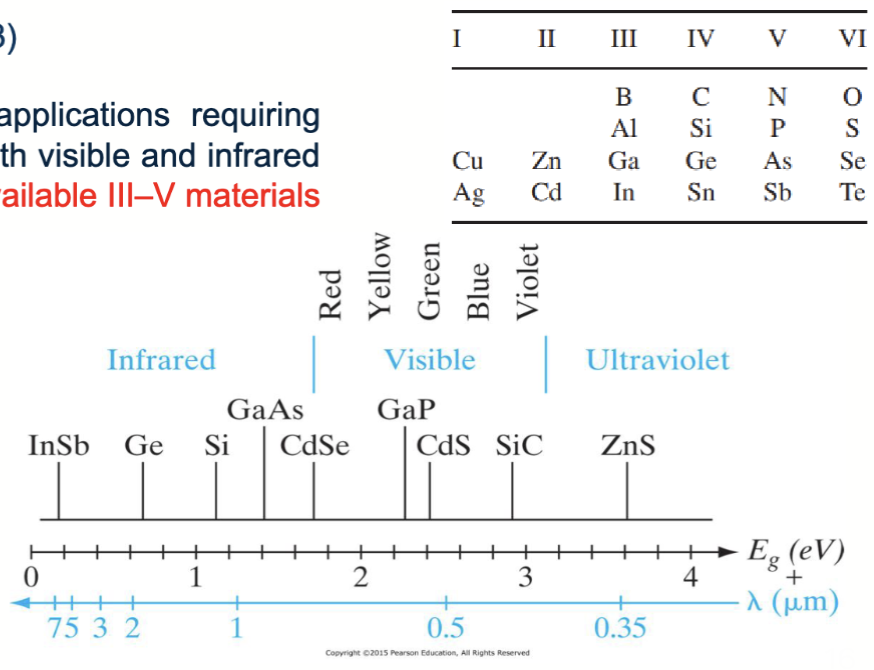

因为不同的材料的带隙差异很大，可以获得的光子能量范围也很广，从紫外光 (ZnS 3.6eV) 延伸到红外光 (InSb 0.18eV)

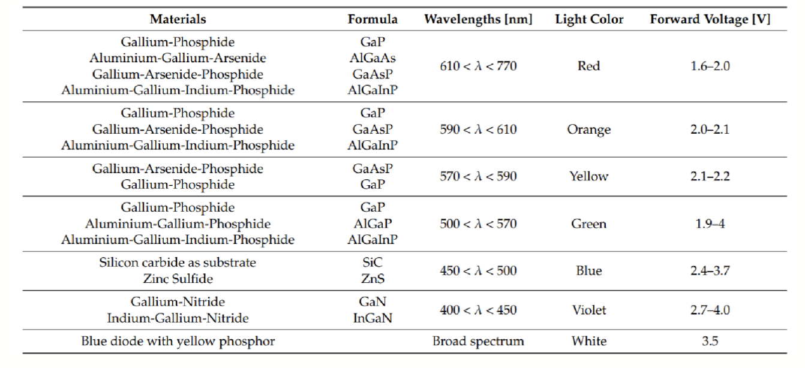

同时，不同半导体材料制成的 LED 发出的光的光谱分布也是不一样的。随着发射能量从光谱的红外端转移到紫外端，发射光谱在波长上变得更窄。

---

LED 的发光强度也在随着时间和工艺改进逐渐提高：

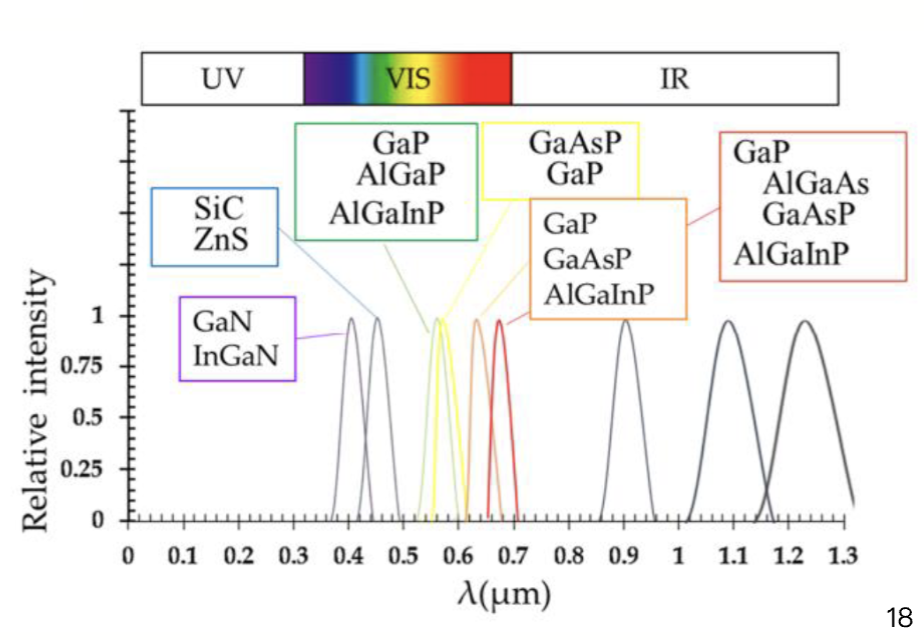

## LED 的电学特性

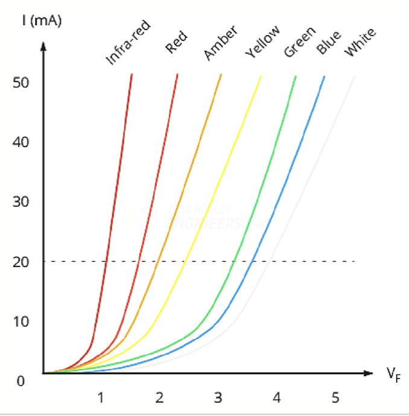

为了得到可见光，带隙大小应该大于 1.8eV。常见的 LED 的工作电压大约在 $1.6V ~3.6V$ 之间，额定电流大小大概为 $10 \mathrm{mA}$ 到 $30 \mathrm{mA}$，其中最常见的范围是 $12 ~20 \mathrm{mA}$。

如果跃迁发生在了直接带隙半导体中，发出的光子波长大小是:

$$
\lambda = \frac{h c}{E_g}
$$

---

和光电二极管类隙，LED 也有一个外量子效率 (external quantum efficiency, EQE)，表示每个注入的电子-空穴对产生的光子数量。其定义为：

$$
\eta_{EQE} = \eta_{IQE} \times \eta_{EXT}
$$

这里的 $\eta_{IQE}$ 是内量子效率 (internal quantum efficiency)，表示在半导体内部每个注入的电子-空穴对产生的光子数量；$\eta_{EXT}$ 是提取效率 (extraction efficiency)，表示从半导体内部发射出来的光子中，有多少比例能够成功逃逸到外部环境中。

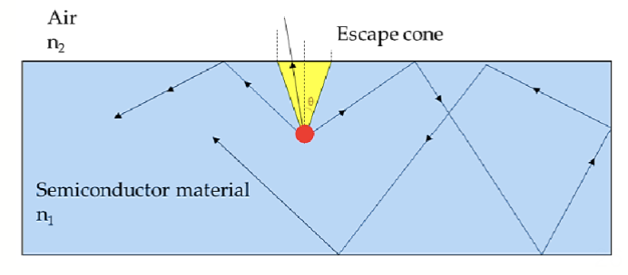

由于一开始产生的光子是在材料内部产生并且向随机方向发射的，因此，其在脱离材料时会发生全反射现象，能逃脱出去的范围我们称之为光逃逸锥 (Light Escape Cone)。其与内全发射 (Total Internal Reflection, TIR) 的角度有关。

$$
\theta_c = \arcsin\frac{n_2}{n_1} \quad (n_1 > n_2)
$$

这里的 $n_1$ 是半导体材料的折射率，$n_2$ 是外部环境（通常是空气）的折射率。由于大部分半导体材料的折射率远大于空气，因此光逃逸锥的角度通常很小，导致提取效率较低。$\theta_c$ 被称为临界角 (critical angle)。

计算临界角对应的锥体对应的球冠形曲面面积：

$$
\mathrm{Area} = 2\pi r^2(1-\cos \theta_c)
$$

然后整个球形的面积大小是 $4\pi r^2$，因此提取效率可以表示为：

$$
P_\mathrm{Scape} = \frac{\mathrm{Area}}{4\pi r^2} = \frac{1 - \cos \theta_c}{2}
$$

可以看出，只有很小一部分光子能够成功逃逸到外部环境中。而对于大部分半导体材料，折射率相当高，比如 GaAs 的折射率大约是 3.5，那么临界角大约是 $16.6^\circ$，对应的提取效率大约只有 $2\%$。

为了提高发光效率，一种常用的技术是使用透明塑料进行封装，这种塑料的折射率大概是 $1.5$。这样可以增加临界角，从而提高提取效率。
