# 太阳能电池 (Solar Cell)

## 太阳能电池简介

太阳能电池大多数使用使用的是硅材料，因为硅目前工艺成熟，可以以较低成本制造。现在的多晶硅电池的效率大概是 $18\%$ 左右，单晶硅电池的效率大概是 $22~24\%$ 左右。

在同一个警惕内制造 PN 结制成的太阳能电池被叫做同质结太阳能电池 (Homojunction Solar Cell)，而使用不同材料制造 PN 结制成的太阳能电池被叫做异质结太阳能电池 (Heterojunction Solar Cell)。

典型的结构如下图所示：

电路符号长这样：

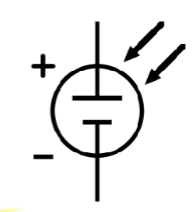

其原理在 1839 年被发现，在 1954 年被贝尔实验室 (Bell Labs) 制造出第一个实用的硅太阳能电池。

---

在 1977 年以来，太阳能电池随着时代变化和累计装机总量的增长，价格大幅下降，如下图所示。这也对 CO2 减排起到了重要作用。

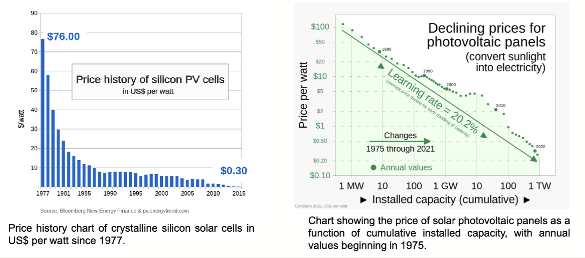
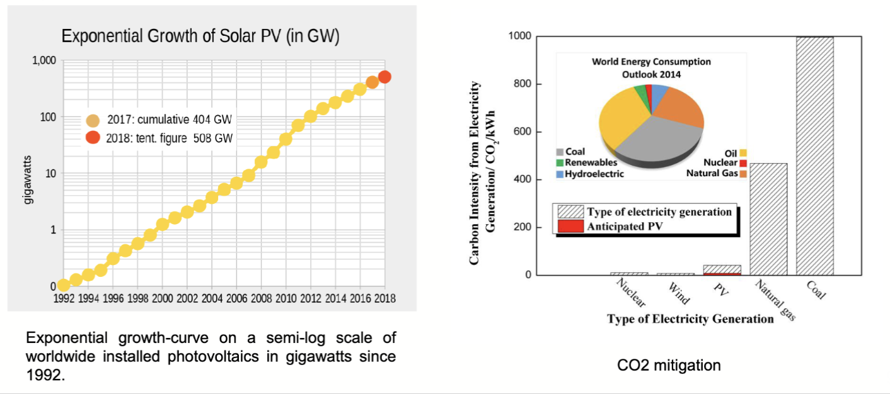

## 太阳能电池的工作原理

在[光电二极管部分](lec4.1.md)我们已经介绍过光生载流子的产生过程。太阳能电池的工作原理和光电二极管类似，都是利用 PN 结的内建电场将光生载流子分离，从而产生电流。

太阳能电池工作在光电二极管的第四象限部分，如下图所示。此时它才会对外提供电流和电压，从而输出功率。

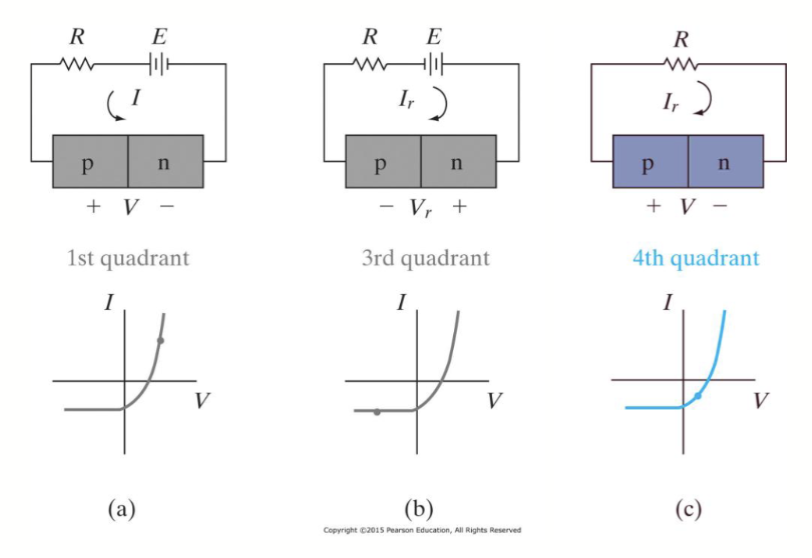

而对于一个典型的太阳能电池，其简化图如图所示

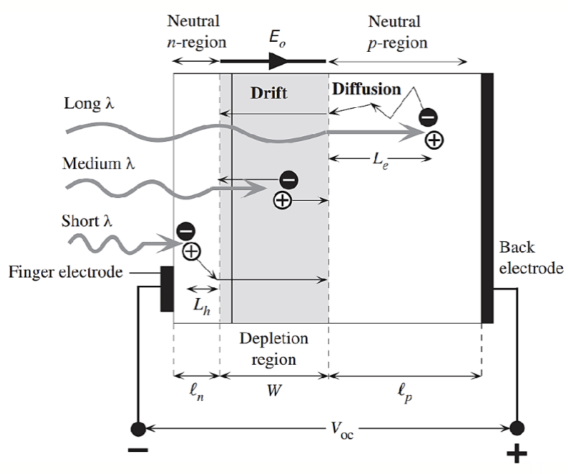

这是一个二极管，由一个 PN 结，其中 P 区非常窄，掺杂更重；P 区较宽，掺杂较轻。耗尽区主要向着 P 区一侧延伸。耗尽区中形成内建电场，随着光照变化。

光照射到电池比较薄的 N 区，产生电子-空穴对。由于内建电场的作用，电子被扫到 N 区，空穴被扫到 P 区，从而形成电流。

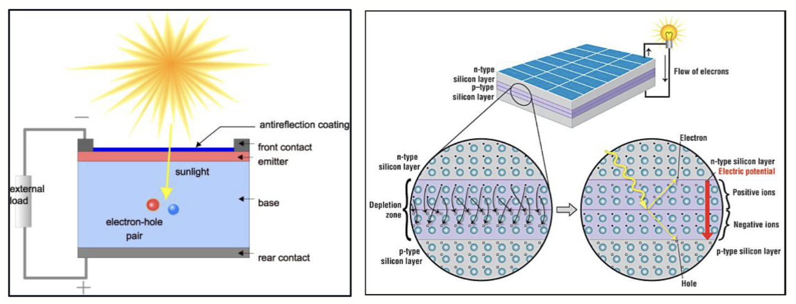

---

常见的二极管的电极是链接在 N 和 P 区的，但是太阳能电池的 N 区需要允许光照进入，同时需要较小的电阻以减小损耗，因此太阳能电池的 N 区电极通常是一个树枝状的金属网格，如下图所示：

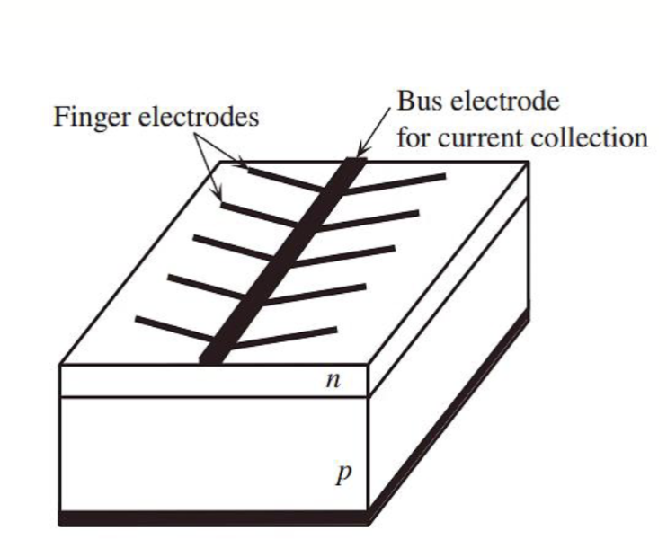

其有一个主干，连接到外部电路，其余的枝杈则尽可能在不挡住光照的情况下覆盖更多的面积以减小电阻损耗。

---

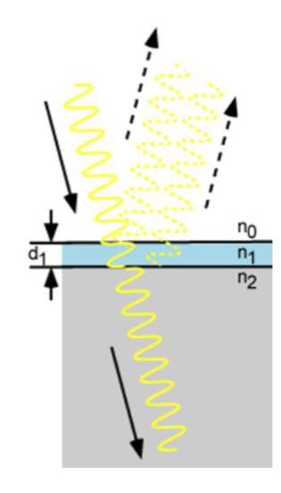

在太阳能电池上也会有一层抗反射层 (Anti-Reflection Coating, ARC)，以减小光的反射损失，提高光的吸收效率。反射率的计算公式如下：

$$
\begin{aligned}
  R &= \frac{
    r_1^2 + r_2^2 + 2\pi \cos 2\theta\degree
  }{
    1 + r_1^2 r_2^2 + 2 r_1 r_2 \cos 2\theta\degree
  }\\
  r_1 & = \frac{n_0 - n_1}{n_0 + n_1}\\
  r_2 & = \frac{n_1 - n_2}{n_1 + n_2}\\
  \theta & = \frac{2\pi n_1 d_1}{\lambda}
\end{aligned}
$$

这里的 $n_0$ 是空气的折射率，$n_1$ 是抗反射层的折射率，$n_2$ 是硅的折射率，$d_1$ 是抗反射层的厚度，$\lambda$ 是入射光的波长。

最终的反射率与厚度、折射率、波长有关。因此，增透层的零反射特性只能在特定波长下发生。对于光伏应用，通常选择最小化 $0.6 \mathrm{\mu m}$ 处的反射率，因为这是太阳光谱中最强的部分。

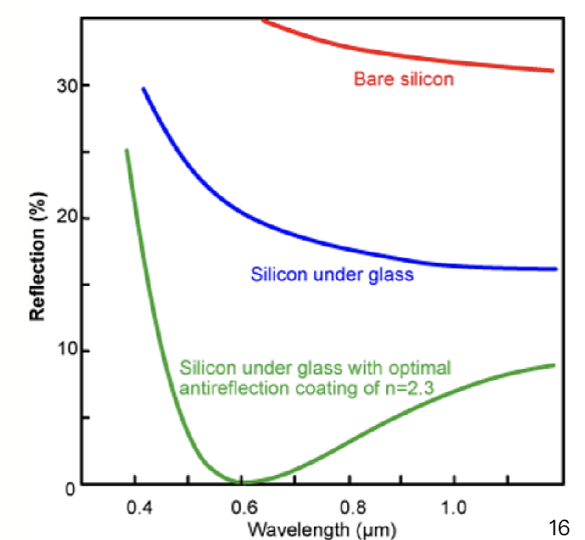

---

和在光电二极管那一张提到的一样，在光照条件下，产生的短路电流大小为

$$
I_{sc} = I_{op} = qA g_{op}(L_n + L_p + W)
$$

其中，$A$ 是电池面积，$g_{op}$ 是光生载流子产生率，$L_n$ 和 $L_p$ 分别是电子和空穴的扩散长度，$W$ 是耗尽区宽度。

开路电压大小为

$$
V_{oc} = \frac{kT}{q} \ln \left( \frac{I_{op}}{I_{th}} + 1 \right)
$$

其中，$I_{th}$ 是暗态下的反向饱和电流。

## 太阳能电池阵列

单个太阳能电池无法提供很多功率，单个电池开路电压通常在 $0.6 ~ 0.8 V$ 左右，产生的电流取决于面积，对于 $1 \mathrm{cm^2}$ 面积的电池，电流大小 $I_{OP}$ 大概在 $10 ~ 100 mA$ 左右。因此，实际应用中通常将多个太阳能电池串联或并联组成太阳能电池阵列 (Solar Cell Array)。

太阳能组成的较大阵列被称为光伏组件 (Photovoltaic module)，其中每个组件是由封装在环境保护层压板重点光伏电池组成的。

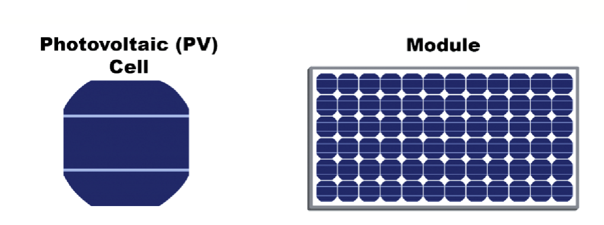

光伏面板 (Photovoltaic panel) 由多个光伏组件组成，通常用于屋顶或地面安装以收集太阳能。这些组件被组装成一个预先接线、可现场安装的单元。

光伏阵列是完整的发电单元，通常由多个光伏面板组成。

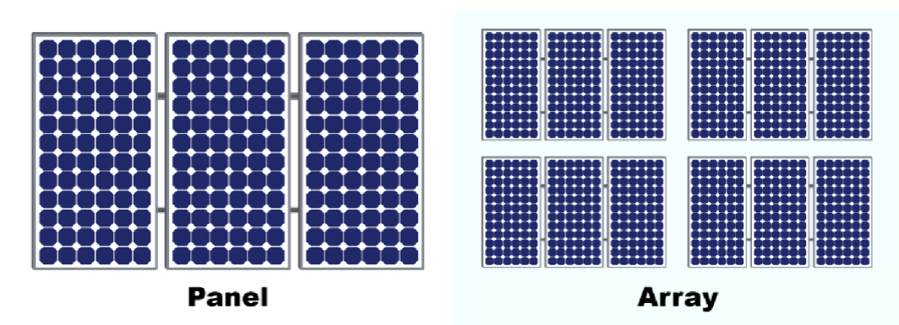

## 太阳能电池的伏安特性

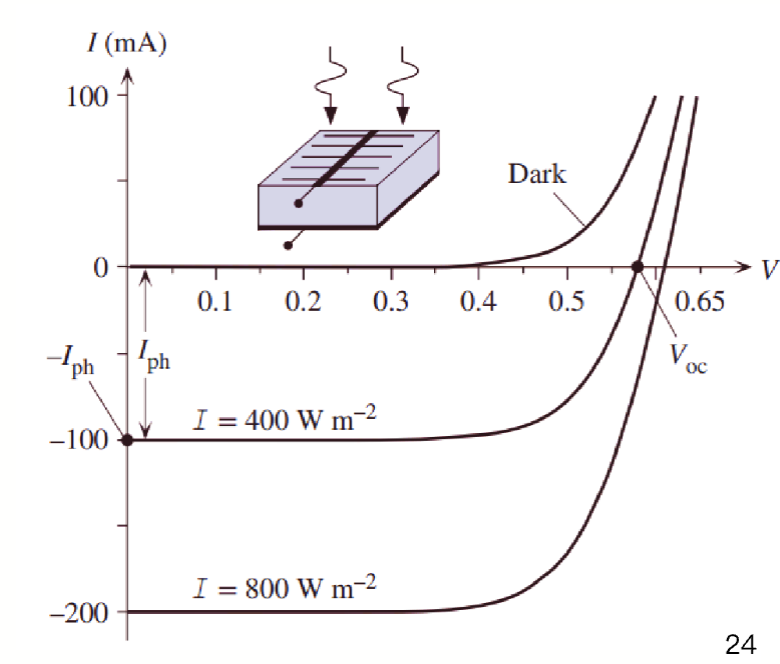

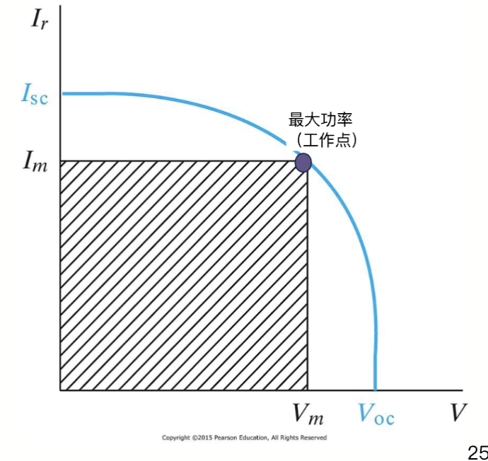

硅太阳能电池的伏安特性如图所示，短路电流表示为 $I_{ph}$，开路电压表示为 $V_{oc}$。如果想要最大化一个太阳能电池的输出功率，就需要得到最大的 $V_m \times I_m$，其中 $V_m$ 和 $I_m$ 分别是最大功率点 (Maximum Power Point, MPP) 处的电压和电流。

我们基于这个定义填充因子 (Fill Factor, FF) 来衡量太阳能电池的性能。这个参数表明了在最佳条件下，太阳能电池能多有效的将可用太阳光部分转化成电能。

$$
\mathrm{FF} = \frac{V_m I_m}{V_{oc} I_{sc}}
$$

填充因子是太阳能电池的一个品质因数，其值通常在 $0.7 ~ 0.85$ 之间，越高表示太阳能电池的性能越好。标准硅光伏电池的填充因子大概是 $80\%$。

## 不同种类的太阳能电池

常见的太阳能电池主要分为三类：单晶硅、多晶硅和薄膜太阳能电池。

单晶硅太阳能电池由单晶结构制成，通常使用高纯度的硅，以高效率和节省空间为特点。其制造过程复杂且成本较高，但效率通常在 $19\%$ 以上。

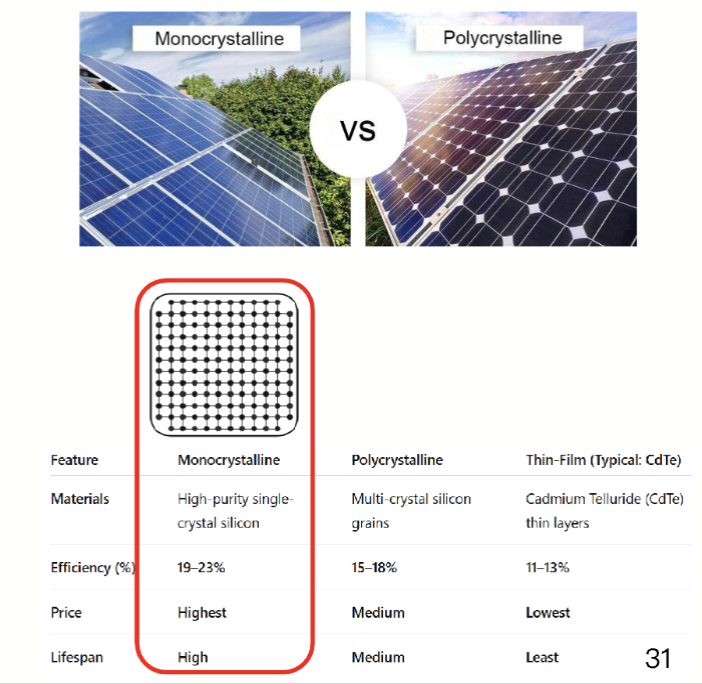

多晶硅太阳能电池使用多晶硅材料制成，通常形态不如单晶硅均匀；成本较低，效率较低，在成本和性能之间取得平衡。其效率通常在 $15\%$ 到 $18\%$ 之间。

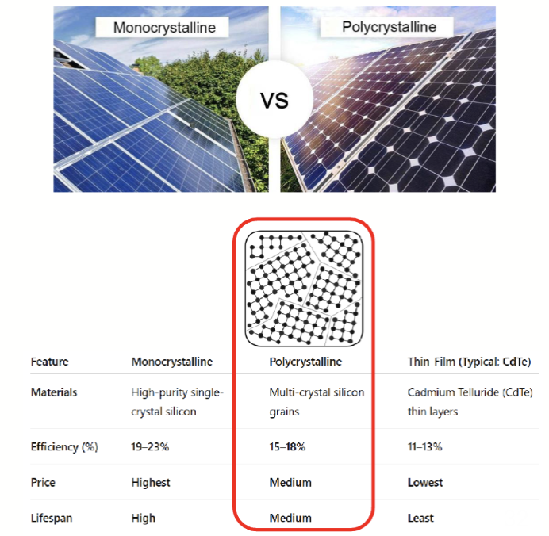

薄膜太阳能电池是使用半导体材料薄层制造的，比如非晶硅 (a-Si)、碲化镉 (CdTe) 和铜铟镓硒 (CIGS) 等。其制造成本低，重量轻，灵活性好，但效率较低，通常在 $11\%$ 到 $13\%$ 之间。灵活，轻量化，便携，可以适用于各种表面。其在某些情况下有成本效益和优势

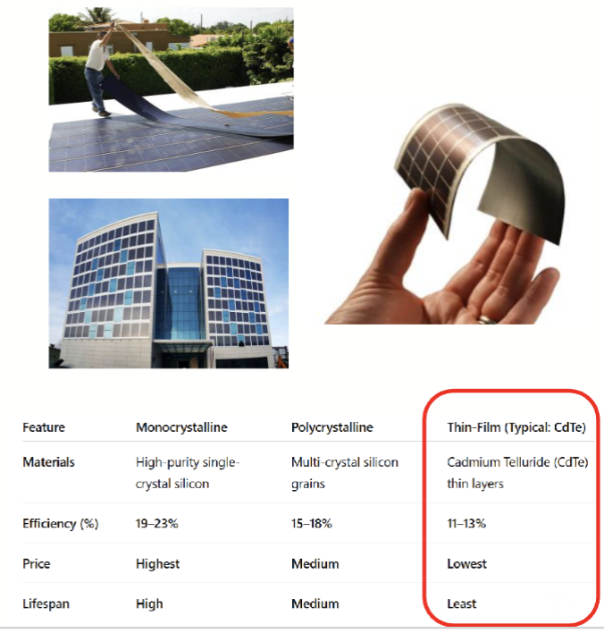
